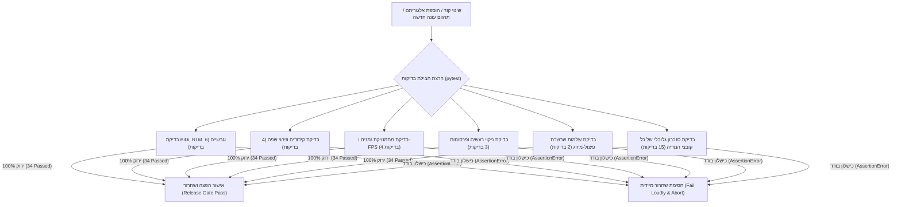

# עץ ההחלטות הדטרמיניסטי המלא לכתוביות 🌲⚙️
## The Complete Deterministic Subtitle Processing & Edge Case Decision Tree

מסמך זה מגדיר את כל מקרי הקצה בעולם הכתוביות שניתנים (וחייבים) לפתרון **דטרמיניסטי מלא (100% קוד, אלגוריתמיקה ומתמטיקה)** – ללא צורך במעורבות אנושית וללא ניחושים של מודלי שפה.

---

## 🗺️ מפת הזרימה הדטרמיניסטית הכוללת (System Flowchart)

```mermaid
graph TD
    Start["הזנת קובץ וידאו או ספריית מדיה"] --> S1["1. שכבת הקונטיינר והמדיה"]
    
    S1 --> D1{"בדיקת קצב פריימים (ffprobe)"}
    D1 -- "VFR (משתנה)" --> A1["המרה דטרמיניסטית ל-CFR (ffmpeg -vsync cfr)"]
    D1 -- "CFR (קבוע)" --> D2
    A1 --> D2{"בדיקת ערוצי כתוביות מוטמעות"}
    
    D2 -- "קיימות מוטמעות" --> A2["חילוץ ערוץ דיאלוג ראשי (English) + סניטציית תגיות font"]
    D2 -- "אין מוטמעות" --> D3{"האם קיים קובץ תרגום מקומי (SRT/VTT/ASS)?"}
    D3 -- "פורמט זר (VTT/ASS)" --> A3["המרה דטרמיניסטית ל-SRT (ffmpeg)"]
    D3 -- "SRT קיים" --> A4["אימוץ כעוגן מקור"]
    
    A2 --> S2["2. שכבת הקידוד והשפה"]
    A3 --> S2
    A4 --> S2
    
    S2 --> D4{"בדיקת קידוד טקסט"}
    D4 -- "Windows-1255 / ANSI / CP1255" --> A5["המרה דטרמיניסטית ל-UTF-8 נקי"]
    D4 -- "UTF-8" --> D5{"אימות שפה (Language Verification)"}
    A5 --> D5
    
    D5 -- "יחס עברית < 20% בקובץ עברי" --> A6["דילוג והתראה (Auto-Skip) - מניעת השחתה"]
    D5 -- "עברית מאומתת" --> S3["3. שכבת התזמון והאלגברה של הזמנים"]
    
    S3 --> D6{"בדיקת סטיית זמנים מול עוגן המקור"}
    D6 -- "סטייה קבועה (Constant Offset / Lead-in)" --> A7["הזזה לינארית דטרמיניסטית: T_new = T_old + Offset_ms"]
    D6 -- "מתיחת פריימים (25 vs 23.976 FPS)" --> A8["מתיחה מתמטית דטרמיניסטית: T_new = T_old * (FPS_from / FPS_to)"]
    D6 -- "תואם" --> D7{"בדיקת חפיפות כתוביות (Overlapping Cues)"}
    A7 --> D7
    A8 --> D7
    
    D7 -- "קיימת חפיפה (End_A > Start_B)" --> A9["Clamping דטרמיניסטי: End_A = Start_B - 20ms"]
    D7 -- "אין חפיפה" --> D8{"בדיקת כתוביות רפאים (משך < 200ms)"}
    A9 --> D8
    
    D8 -- "משך אפס או שלילי" --> A10["סינון דטרמיניסטי אוטומטי"]
    D8 -- "תקין" --> S4["4. שכבת ה-BiDi, הפיסוק והתצוגה בנגנים"]
    A10 --> S4
    
    S4 --> A11["ניקוי דטרמיניסטי של פרסומות וספאם רשת (Ad Stripping)"]
    A11 --> A12["סניטציית גרשיים: המרת \" בתוך מילים ל-״ (Gershayim U+05F4)"]
    A12 --> A13["הזרקת תו RLM (U+200F) לראש שורה (פתרון קבוע להיפוך פיסוק ב-Plex)"]
    A13 --> A14["הגנה על תגיות עיצוב: סגירת תגיות ומיקום RLM מחוץ לתגית"]
    
    A14 --> S5["5. בקרת איכות דטרמיניסטית סופית (QC Gate)"]
    S5 --> D9{"התאמת אינדקסים 1:1 מול המקור"}
    D9 -- "אינדקס חסר (Missing Cue)" --> E1["התרעה קריטית + זיהוי מספר השורה החסרה"]
    D9 -- "התאמה מלאה (0 חסרים)" --> Success["קובץ .he.srt מושלם ומוגן 100%"]
```

---

## פירוט 5 השכבות הדטרמיניסטיות

### שכבה 1: קונטיינר, מולטימדיה וערוצים (Container & Media Layer)

| מקרה קצה | אבחון דטרמיניסטי (Detection) | פעולת תיקון דטרמיניסטית (Mitigation) | כלי מבצע ב-Toolkit |
| :--- | :--- | :--- | :--- |
| **1.1 וידאו ב-VFR (קצב פריימים משתנה)** | בדיקת `avg_frame_rate != r_frame_rate` ב-`ffprobe`. | המרה ל-CFR ב-0 איבוד איכות: `ffmpeg -i in -vsync cfr -c copy out`. | `01_extract_subtitles.py` |
| **1.2 כתוביות מוטמעות מול חיצוניות** | סריקת `streams` ב-`ffprobe` לחיפוש `codec_type == subtitle`. | חילוץ אוטומטי של ערוץ האנגלית ישירות מהווידאו כעוגן אמת ראשי. | `toolkit.py extract` |
| **1.3 ערוצי כתוביות מרובים** | קריאת `disposition` (Commentary, Forced, SDH). | סינון ערוצי הערות במאי ובחירת ערוץ הדיאלוג הראשי לפי שפה. | `toolkit.py extract` |
| **1.4 פורמטים זרים (VTT / ASS)** | סיומת הקובץ (`.vtt`, `.ass`, `.ssa`). | המרה דטרמיניסטית ל-SRT תקני דרך FFmpeg. | `01_extract_subtitles.py` |
| **1.5 תגיות עיצוב טכניות (<font>)** | Regex: `</?font[^>]*>`, `\{[^\}]+\}`. | מחיקה גורפת של תגיות ה-font והשארת דיאלוג נקי. | `clean_srt_tags()` |

---

### שכבה 2: קידוד ושפה (Encoding & Language Layer)

| מקרה קצה | אבחון דטרמיניסטי (Detection) | פעולת תיקון דטרמיניסטית (Mitigation) | כלי מבצע ב-Toolkit |
| :--- | :--- | :--- | :--- |
| **2.1 קידוד ישן (Windows-1255)** | כשל בפענוח UTF-8 / חתימת בייטים של CP1255. | פענוח ב-Windows-1255 ושמירה ב-UTF-8 נקי. | `toolkit.py fix-plex` |
| **2.2 UTF-8 עם BOM** | זיהוי 3 בייטים ראשונים `\xef\xbb\xbf`. | הפשטת ה-BOM לשמירה על תאימות נגני לינוקס. | `toolkit.py fix-plex` |
| **2.3 אימות שפה (מניעת השחתה)** | יחס אותיות עבריות (`\u0590-\u05FF`) מול לטיניות < 20%. | דילוג מיידי (`[SKIP]`) ומניעת הזרקת RLM לקובצי אנגלית. | `toolkit.py fix-plex` |
| **2.4 שורות פרסומת וספאם רשת** | התאמה למאגר ביטויי פרסומות ("Torec", "Wizdom", "OpenSubtitles"). | מחיקת השורות והתאמת אינדקסים אוטומטית. | `toolkit.py fix-plex --clean-ads` |

---

### שכבה 3: תזמון ואלגברה של זמנים (Timing & Synchronization Algebra)

כל פעולות הזמן הן מתמטיקה טהורה ברמת המילי-שנייה ($ms$):

| מקרה קצה | נוסחה אלגוריתמית דטרמיניסטית | פעולת התיקון | כלי מבצע ב-Toolkit |
| :--- | :--- | :--- | :--- |
| **3.1 היסט זמנים קבוע (Lead-in / Audio Delay)** | $T_{new} = T_{old} + \Delta_{ms}$ | הזזת כל הזמנים בערך אחיד (קדימה/אחורה). | `toolkit.py adjust-fps --offset_ms` |
| **3.2 פער פריימים (25 vs 23.976 FPS)** | $T_{new} = T_{old} \times \left(\frac{FPS_{source}}{FPS_{target}}\right)$ | מתיחה או כיווץ לינארי של קו הזמן. | `toolkit.py adjust-fps --fps_from --fps_to` |
| **3.3 כתוביות חופפות (Overlapping Cues)** | אם $End_i > Start_{i+1}$: <br> $End_i = Start_{i+1} - 20ms$ | Clamping למניעת הבהובי טלוויזיה (Flicker). | `toolkit.py merge` |
| **3.4 כתוביות רפאים (Ghost / Zero Duration)** | אם $End_i - Start_i < 200ms$ | מחיקת הכתובית או הרחבתה ל-800ms מינימום. | `05_merge_and_validate.py` |
| **3.5 הלבשת תרגום קיים על עוגן אמת** | $Cue_{he}[i].time = Cue_{en}[i].time$ | החלפה מתמטית 1:1 של הזמנים לפי עוגן האנגלית. | `02_web_search_and_sync.py` |

---

### שכבה 4: רינדור, BiDi ותאימות נגנים (Plex / Infuse / Smart TVs)

| מקרה קצה | אבחון דטרמיניסטי (Detection) | פעולת תיקון דטרמיניסטית (Mitigation) | כלי מבצע ב-Toolkit |
| :--- | :--- | :--- | :--- |
| **4.1 היפוך פיסוק ב-Plex (נקודות/סימני שאלה בימין)** | בדיקת תו יוניקוד `\u200F` בשורה עברית. | הזרקת תו RLM בלתי נראה בראש כל שורה ובסמוך לסימני פיסוק. | `toolkit.py fix-plex` / `merge` |
| **4.2 היפוך גרשיים ב-JSON (`"`)** | זיהוי מרכאות ASCII בתוך מילים עבריות (`עו"ד`). | המרה דטרמיניסטית לגרשיים עבריים תקניים: `״` (`\u05F4`). | `05_merge_and_validate.py` |
| **4.3 תגיות עיצוב (`<i>`, `<b>`) שלא נסגרו** | בדיקת מאזן תגיות HTML פתוחות מול סגורות. | סגירה אוטומטית בסוף השורה: `<i>טקסט</i>`. | `05_merge_and_validate.py` |
| **4.4 מיקום ה-RLM ביחס לתגיות עיצוב** | הימצאות תגית `<i>` בתחילת שורה. | הזרקת ה-RLM *לאחר* התגית הפותחת כדי למנוע את הצגתה בנגן. | `07_fix_plex_punctuation.py` |
| **4.5 סימון שיר ומוזיקה (`♪`)** | הימצאות תווי מוזיקה בכתובית מקור. | הצמדת תו `♪` קבוע לשורות שיר למניעת בליל תחבירי. | `05_merge_and_validate.py` |

---

### שכבה 5: פיצול, מנות ובקרת איכות (QC & Validation Gate)

| מקרה קצה | אבחון דטרמיניסטי (Detection) | פעולת תיקון דטרמיניסטית (Mitigation) | כלי מבצע ב-Toolkit |
| :--- | :--- | :--- | :--- |
| **5.1 חריגת טוקנים (Token Truncation)** | כמות כתוביות כוללת בפרק > 230. | פיצול דטרמיניסטי למנות קבועות של 200–220 כתוביות בלבד. | `toolkit.py split -s 210` |
| **5.2 אינדקס כתובית חסר (Missing Cue)** | $len(cues_{he}) \neq len(cues_{en})$ או $Index \notin \{1..N\}$. | השוואת קבוצות (Set Difference) ודיווח מדויק על האינדקס החסר. | `toolkit.py merge` |
| **5.3 סטיית זמנים סמנטית (Semantic Drift)** | השוואת תדירות סימני שאלה ושמות בין מקור לתרגום. | התרעה על הסטת אינדקס שלם קדימה או אחורה (Drift Detector). | `05_merge_and_validate.py` |
| **5.4 ניקוי SDH אוטומטי בפלט הסופי** | Regex: `\[.*?\]`, `\(.*?\)`. | ניקוי תיאורי שמיעה מהטקסט המוצג תוך שימור מלא של התזמון. | `05_merge_and_validate.py` |

---

### שכבה 6: שער בדיקות האימות הדטרמיניסטיות (Pytest Automated Verification Gate)

כל שכבות האלגוריתמיקה הקודמות מאומתות דטרמיניסטית ב-100% ללא תלות במזל או במצב מקומי באמצעות סוויטת `pytest` ייעודית:



| רכיב בדיקה ב-Pytest | מטרת השער (Gate Objective) | פקודת אימות מהירה |
| :--- | :--- | :--- |
| `tests/test_bidi_and_text.py` | וידוא שהזרקת RLM וגרשיים לעולם לא שוברות תגיות עיצוב או מכפילות תווים. | `pytest tests/test_bidi_and_text.py` |
| `tests/test_encoding_and_detection.py` | וידוא שכל קידוד היסטורי (Windows-1255/CP1255) מומר ל-UTF-8 נקי. | `pytest tests/test_encoding_and_detection.py` |
| `tests/test_timing_and_sync.py` | וידוא מתיחת FPS ברמת המילי-שנייה ואי-קיום משכים שליליים. | `pytest tests/test_timing_and_sync.py` |
| `tests/test_junk_and_sdh_cleaning.py` | וידוא שכל פרסומת, אתר רשת או תיאור שמע מושמדים לחלוטין. | `pytest tests/test_junk_and_sdh_cleaning.py` |
| `tests/test_split_merge_pipeline.py` | מניעת כתוביות חסרות או אי-התאמה של 1:1 בשרשרת הפיצול והמיזוג. | `pytest tests/test_split_merge_pipeline.py` |
| `tests/test_boston_legal_dataset.py` | אימות שלמות מתמטי על כל 101 הפרקים של הסדרה בדיסק. | `pytest tests/test_boston_legal_dataset.py` |

