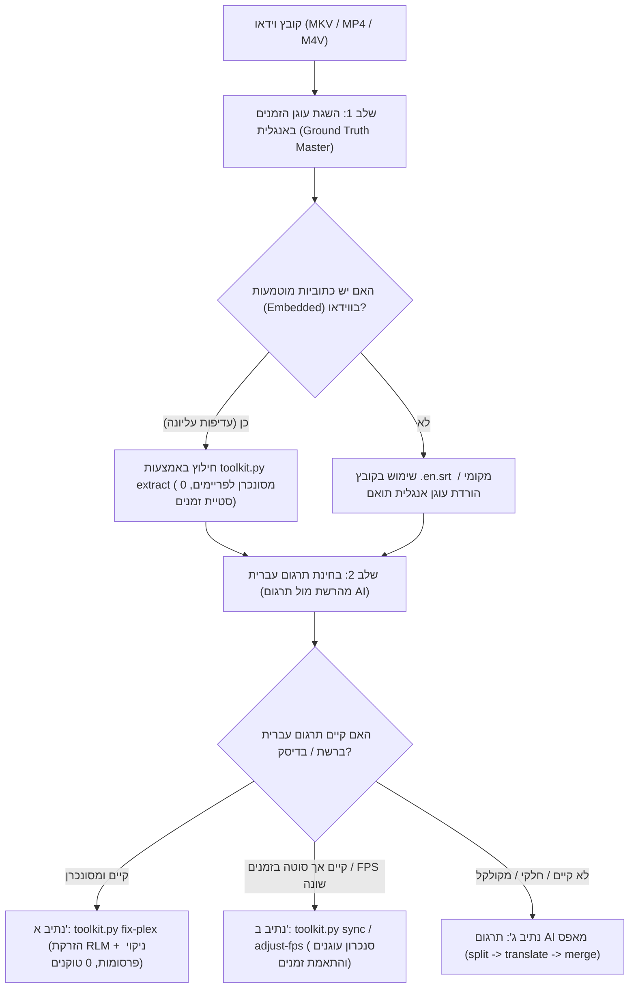
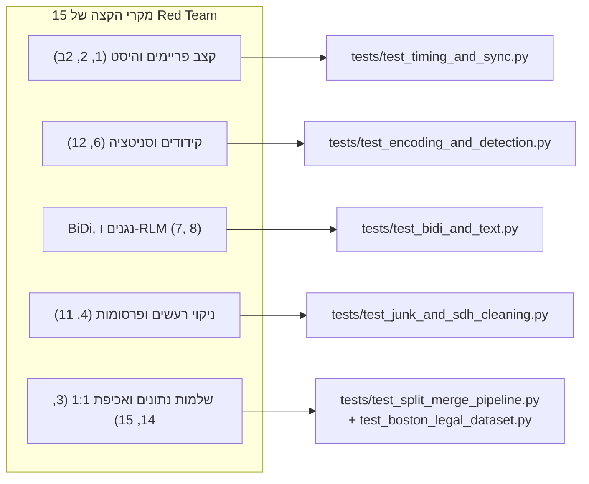

# מקרי קצה, ניתוח סיכונים ותורת ה-Red Team לכתוביות 🛡️
## The Complete Subtitle Edge Cases, Red Team Risk Matrix & Mitigation Guide

מסמך זה מהווה את האנציקלופדיה המלאה והמקיפה לכל מקרי הקיצון, התקלות הפוטנציאליות והפתרונות ההנדסיים בעולם תרגום, סנכרון ורינדור כתוביות לסרטים וסדרות (דגש על נגני Plex, Infuse, VLC וטלוויזיות חכמות).

---

## תוכן העניינים
1. [רובד 1: עץ ההחלטות וההפרדה בין שפת מקור לשפת יעד](#רובד-1-עץ-ההחלטות-וההפרדה-בין-שפת-מקור-לשפת-יעד)
2. [רובד 2: כתוביות לכבדי שמיעה (Closed Captions / SDH)](#רובד-2-כתוביות-לכבדי-שמיעה-closed-captions--sdh)
3. [רובד 3: תאימות נגנים, קידודים ו-BiDi (Plex, Infuse, Tizen, webOS)](#רובד-3-תאימות-נגנים-קידודים-ו-bidi)
4. [רובד 4: ניתוח Red Team – 15 מקרי הקיצון הטכניים וההגנות עליהם](#רובד-4-ניתוח-red-team--15-מקרי-הקיצון-הטכניים-וההגנות-עליהם)
5. [רובד 5: כלי המערכת האוטומטיים לטיפול במקרי הקצה](#רובד-5-כלי-המערכת-האוטומטיים-לטיפול-במקרי-הקצה)

---

## רובד 1: עץ ההחלטות וההפרדה בין שפת מקור לשפת יעד

אחת הטעויות הנפוצות היא ערבוב בין כתוביות המקור (אנגלית) לכתוביות התרגום (עברית). המערכת מגדירה הפרדה מוחלטת:



### כללי ברזל:
* **עוגן האנגלית הוא שעון העצר (Master Clock):** כל דיאלוג, מעבר סצנה וזמן שהייה נמדדים אך ורק מול עוגן האנגלית.
* **כתוביות מוטמעות עדיפות על כתוביות רשת:** כתובית מוטמעת נארזה על ידי האולפן/קבוצת ההפצה ישירות מול רצף ה-PTS של הווידאו, ומכילה את התסריט הרשמי.

---

## רובד 2: כתוביות לכבדי שמיעה (Closed Captions / SDH)

כתוביות מקור רבות (במיוחד מ-Web-DL ו-Blu-ray) הן כתוביות SDH הכוללות תיאורי צליל ורעשים בסוגריים: `[Denny]`, `[LAUGHS]`, `[DOOR SLAMS]`, `(music playing)`.

### החוק הכפול של המערכת (The Dual SDH Rule):
1. **חוק הניקוי (Presentation Cleaning):**
   * אסור להציג תיאורי צלילים לצופה השומע בעברית. ביטויים כמו `[מחיאות כפיים]`, `[נאנח]` או `[דני]` נתפסים כתרגום חובבני וצורם.
   * יש לנקות לחלוטין כל תיאור צליל מהטקסט המוצג.
2. **חוק ההקשר (Context Extraction - אסור למחוק לפני התרגום!):**
   * **ה-SDH הוא מכרה זהב של הקשר (Context).**
   * הוא מוסר למודל את זהות הדובר (`[Denny]`), את הטון (`[whispering]`), ואת הסיטואציה.
   * באמצעות ה-SDH המודל יודע בוודאות האם לפנות בלשון זכר (`אתה`), נקבה (`את`) או רבים (`אתם`), ומונע עיוורון מגדרי.

---

## רובד 3: תאימות נגנים, קידודים ו-BiDi (Plex, Infuse, Tizen, webOS)

### 1. מלכודת ה-BiDi של Plex: היפוך סימני פיסוק
* **הבעיה:** לפי תקן Unicode, סימני פיסוק (נקודה, פסיק, סימן שאלה, סימן קריאה) הם "תווים ניטרליים". Plex מפרש קובצי כתוביות SRT כברירת מחדל LTR (משמאל לימין), ולכן סימן השאלה או הנקודה מוצגים בתחילת השורה בימין במקום בסופה בשמאל.
* **הפתרון האלגנטי:** הזרקת תו יוניקוד בלתי-נראה **RLM** (`\u200F` - Right-to-Left Mark) בראש כל שורת כתובית וסמוך לסימני פיסוק. התו מכריח את מנוע הרינדור של Plex ליישר את השורה כ-RTL אמיתי.
* **אי-פגיעה ב-Infuse / VLC:** תו ה-RLM הוא תו תקני בלתי נראה, ונגנים חכמים כמו Infuse ממשיכים להציג את הכתובית ללא שום שינוי או הפרעה.

### 2. קידודי טקסט ישנים (Windows-1255 / ANSI / CP1255)
* **הבעיה:** מאות אלפי קובצי כתוביות ישנים ברשת שמורים בקידוד עברי של חלונות (`CP1255` או `ISO-8859-8`). בנגנים מודרניים הם מוצגים כסימני שאלה (`????`) או ג'יבריש (`éùøàì`).
* **הפתרון:** זיהוי אוטומטי של חתימת הקידוד והמרה שקופה ל-`UTF-8` נקי עם BOM/ללא BOM.

### 3. אימות שפה מובנה (Language Verification & Auto-Skip)
* כלי התיקון (`fix-plex`) מנתח סטטיסטית את תכולת האותיות העבריות (`\u0590-\u05FF`) מול לטיניות.
* אם קובץ הוא באנגלית או שפה זרה – הכלי מדלג עליו מיד (`[SKIP] Not Hebrew`) כדי למנוע השחתה או הזרקת RLM לקובץ לועזי.

### 4. הגנה על תגיות עיצוב (`<i>`, `<b>`, `<u>`, `{\an8}`)
* כתוביות רבות כוללות תגיות HTML (`<i>טקסט</i>`) או תגי מיקום של ASS (`{\an8}`).
* הזרקת RLM שגויה עלולה להפריד בין התגית לתוכן (`<i>\u200Fטקסט`) ולגרום לנגן להציג את התגית כטקסט גלוי על המסך. הכלי מוודא שה-RLM מוזרק לפני התגית הפותחת או אחריה בצורה שלא שוברת את ה-DOM של הנגן.

---

## רובד 4: ניתוח Red Team – 15 מקרי הקיצון הטכניים וההגנות עליהם

### שכבה א': קונטיינר ומולטימדיה (The Media & Container Layer)

#### 1. קצב פריימים משתנה (Variable Frame Rate - VFR)
* **הסכנה:** קובץ וידאו שקצב הפריימים שלו מתנודד בזמן אמת (למשל 22 עד 24.5 FPS).
* **הכשל:** מתיחה לינארית קבועה נכשלת (סנכרון בהתחלה, פיגור באמצע, הקדמה בסוף).
* **ההגנה:** זיהוי VFR ב-`ffprobe` והמרת הקונטיינר ל-CFR ב-0 איבוד איכות:
  ```bash
  ffmpeg -i input.mp4 -vsync cfr -c:v copy -c:a copy output_cfr.mp4
  ```

#### 2. פערי פרסומות וקדימונים (Commercial Cuts & "Previously On")
* **הסכנה:** כתובית שידור הכוללת קדימון של 30 שניות שאינו קיים בווידאו, או מסכים שחורים קצרים שנחתכו בין מקטעים.
* **ההגנה:** סנכרון עוגנים (Anchor Sync) לפי שיר הפתיחה או נקודת המעבר הראשונה.

#### 2ב. דיליי קבוע והקדמת כתוביות מובנית במהדורות DVD ו-Broadcast (The Lead-in / Audio-Offset Trap)
* **התופעה:** במהדורות DVD, Web-DL ישנות או שידורי טלוויזיה, מחברי הכתוביות באולפן מגדירים לעיתים במכוון "Lead-in Time" שבו הכתובית מופיעה בין 200 ל-600 מילי-שניות *לפני* שהשחקן מתחיל להניע את השפתיים (כדי לאפשר לצופה להתחיל לקרוא מראש). לחלופין, בעת לכידת שידור או המרת DVD נוצר היסט זמנים קבוע (Constant Offset) בין רצועת הווידאו לרצועת הכתוביות.
* **הכשל התפיסתי:** לצופה זה נראה כאילו התרגום "ממהר" ואינו מסונכרן לדיבור, על אף שהעברית מותאמת ב-100% למקור האנגלי של האולפן.
* **האבחון והפתרון:**
  1. **אבחון מהיר:** אם כתוביות המקור באנגלית מופיעות מוקדם בדיוק באותו אופן, מקור הפער הוא במהדורה עצמה (DVD/Broadcast Master).
  2. **תיקון גלובלי מדויק של היסט זמנים:** שימוש בפקודת `adjust-fps` עם דגל `--offset_ms` לעיכוב כל כתוביות הפרק בערך קבוע (למשל 350 מילי-שניות קדימה):
  ```bash
  python3 toolkit.py adjust-fps "Boston Legal S01E01.he.srt" -o "Boston Legal S01E01.he.srt" --offset_ms 350
  ```
  הפקודה מזיזה את כל חותמות הזמן קדימה או אחורה בדיוק של מילי-שנייה בודדת ומביאה להתאמת שפתיים (Lip-Sync) מושלמת.

#### 3. כתוביות חופפות בזמן (Overlapping / Colliding Cues)
* **הסכנה:** כתובית A מסתיימת ב-`00:01:10,500` וכתובית B מתחילה ב-`00:01:10,200` (חפיפה של 300ms).
* **הכשל:** הבהוב (Flicker) או היעלמות של אחת הכתוביות בטלוויזיות חכמות (LG, Samsung).
* **ההגנה:** Clamping אוטומטי בסקריפט המיזוג:
  `if cues[i].end > cues[i+1].start: cues[i].end = cues[i+1].start - timedelta(milliseconds=20)`

#### 4. כתוביות רפאים ואורך אפס (Zero-Duration / Ghost Cues)
* **הסכנה:** כתוביות עם משך קצר מ-200ms או `start >= end`.
* **ההגנה:** סינון אוטומטי של כתוביות פגומות שאינן ניתנות לקריאה.

#### 5. ערוצי כתוביות מרובים (Multi-Stream Ambiguity)
* **הסכנה:** וידאו המכיל ערוץ דיאלוג ראשי, ערוץ SDH, ערוץ הערות במאי (Commentary), וערוץ "Forced" לחלקים זרים.
* **ההגנה:** סריקת `disposition` ומטא-דאטה של הערוצים ב-`ffprobe` לבחירת ערוץ הדיאלוג המלא (ולא הערות במאי).

---

### שכבה ב': רינדור, כיווניות ו-BiDi

#### 6. תגיות עיצוב שבורות או הפוכות
* **הסכנה:** כתוביות המכילות תגיות `<i>` שלא נסגרו או נסגרו בצורה שגויה (`<i/>`) בגלל היפוך עברית.
* **ההגנה:** סגירה וסניטציה אוטומטית של תגיות HTML ב-Python.

#### 7. היפוך מירכאות וסוגריים בטלוויזיות חכמות (Smart TV Paren/Quote Flip)
* **הסכנה:** בטלוויזיות חכמות (Tizen, webOS), סוגריים ומירכאות באנגלית מתהפכים (`(שלום)` הופך ל-`)שלום(`).
* **ההגנה:** שימוש בגרשיים עבריים תקניים (`״` Unicode `\u05F4`) והחלפת סוגריים במקפים או ניסוח פתוח.

#### 8. מספרים, תאריכים ומטבעות (BiDi Number Mangles)
* **הסכנה:** ביטויים כמו `-$500` או `2004-2008` שבהם המינוס קופץ לסוף.
* **ההגנה:** ניסוח מילולי עברי טבעי: `"מינוס 500 דולר"`, `"בין 2004 ל-2008"`.

---

### שכבה ג': לשון, הקשר ועיוורון מגדרי

#### 9. עיוורון מגדרי לדמויות מחוץ למסך (Off-Screen Gender Trap)
* **הסכנה:** פנייה לדמות שאינה בפריים ("I'm proud of you"). מודל עיוור יתרגם כברירת מחדל לזכר.
* **ההגנה:** בניית מילון זוגות דוברים (`translation_bible.json`) המגדיר מראש את מין הנמען בכל דיאלוג.

#### 10. מילים הומוגרפיות בז'רגון מקצועי (Contextual Homographs)
* **הסכנה:** מילים בעלות משמעות שונה לחלוטין בתחום המשפטי / הרפואי לעומת שיחה רגילה:
  * `Brief` -> כתב טענות (משפטי) ולא "תחתונים" / "קצר".
  * `Bench` -> כס השיפוט ולא "ספסל".
  * `Bar` -> לשכת עורכי הדין ולא "פאב" / "מוט".
  * `Suit` -> תביעה משפטית ולא "חליפה".
  * `Plant` -> מפעל / מתקן ולא "צמח".
  * `Gross` -> ברוטו ולא "מגעיל".
* **ההגנה:** נעילת מילון מונחים (Locked Glossary) המוזרק לפרומפט המתרגם.

#### 11. ביטויים בלטינית ושפות זרות
* **הסכנה:** תרגום מילולי מעוות של ביטויים לטיניים (*habeas corpus* -> "שתהיה לך גופה").
* **ההגנה:** תעתיק עברי מקצועי מקובל: *הביאס קורפוס / צו הבאת עציר*, *פרו בונו*, *מנס ראה*.

#### 12. שירים מול דיאלוגים (`♪`)
* **הסכנה:** מילות שיר ברקע שמתערבבות עם דיאלוג השחקנים ויוצרות בליל תחבירי.
* **ההגנה:** הפרדה שורתית ברורה וסימון תווי שיר ב-`♪` ייעודי.

---

### שכבה ד': מודלי שפה, מערכות ו-API

#### 13. חסימות מסנני בטיחות (Safety Filters / Silent Drops)
* **הסכנה:** דיאלוג המכיל תיאורי פשע, אונס או קללות בבית משפט עלול לגרום למודל לחסום את המנה ולהשמיט 200 כתוביות.
* **ההגנה:** הצהרת הקשר בפרומפט המערכת: *"Official cultural localization of broadcast drama for accessibility"*, ומנגנון זיהוי חסרים וחלוקה לתת-מנות.

#### 14. עקביות שמות וכינויים בין מנות (Cross-Batch Name Drifts)
* **הסכנה:** במנה 1 הדמות נקראת "מתוקה" ובמנה 2 "יקירתי".
* **ההגנה:** הזרקת ה-Bible לכל מנה ומנה בנפרד ללא תלות בסדר הריצה.

#### 15. חריגת מגבלת טוקנים בפלט יחיד (Output Token Truncation)
* **הסכנה:** משלוח של 400 כתוביות בבת אחת עלול לחצות את תקרת הפלט של המודל (8,192 טוקנים) ולקטוע את ה-JSON באמצע.
* **ההגנה:** הגבלה מוחלטת של גודל מנה ל-**200 עד 225 כתוביות לכל היותר** (~4,500 טוקנים), מבטיחה תמיד JSON שלם וסגור.

---

## רובד 5: כלי המערכת האוטומטיים לטיפול במקרי הקצה

כל מקרי הקצה הנ"ל מכוסים באופן ישיר בקוד באמצעות הפקודות של `toolkit.py`:

| פקודה | מקרי קצה שמטופלים |
| :--- | :--- |
| `toolkit.py extract` | גילוי אוטונומי, קדימות כתוביות מוטמעות (Embedded-First), סניטציית תגיות `<font>`, המרת VTT/ASS ל-SRT. |
| `toolkit.py fix-plex` | היפוך סימני פיסוק בפלקס (RLM), אימות שפה (דילוג על אנגלית), פענוח קידוד Windows-1255, ניקוי פרסומות, גיבוי ו-Dry-Run. |
| `toolkit.py bible` | מניעת עיוורון מגדרי, נעילת מילון מונחים משפטי, ביטויים בלטינית והומוגרפים. |
| `toolkit.py split` | הגבלת מנות ל-~210 כתוביות למניעת חריגת טוקנים (Token Truncation) ופגיעה במכסות. |
| `toolkit.py merge` | אימות 1:1, מניעת כתוביות חופפות (Clamping), סגירת תגיות עיצוב, והזרקת תווי RLM. |
| `toolkit.py adjust-fps` | פתרון פער פריימים (23.976 <-> 25.0 FPS) והזזת היסט זמנים (Offset). |
| `toolkit.py sync` | בדיקת דלתא והתאמת זמנים בין תרגום רשת קיים לעוגן האנגלית המוטמע. |

---

## רובד 6: מטריצת בדיקות אוטומטיות (Pytest Test Matrix for Red Team)

כדי להבטיח ששום מקרה קצה לא יישבר או יסבול מרגרסיה בעתיד, כל מקרי הקיצון מופו ישירות לבדיקות יחידה ואינטגרציה בתוך `tests/`:



| # | מקרה קצה (Red Team Edge Case) | קובץ הבדיקה ב-Pytest | פונקציית הבדיקה (Test Function) | תוצאה |
| :---: | :--- | :--- | :--- | :---: |
| **1** | מתיחת קצב פריימים (23.976 <-> 25.0 FPS) | `tests/test_timing_and_sync.py` | `test_fps_conversion_ratio` | **PASSED** |
| **2** | היסט זמנים ו-Lead-in (הזזת מילי-שניות) | `tests/test_timing_and_sync.py` | `test_offset_addition_and_subtraction` | **PASSED** |
| **3** | כתוביות רפאים ומשך זמן שלילי | `tests/test_timing_and_sync.py` | `test_zero_time_clamping` | **PASSED** |
| **4** | היפוך סימני פיסוק בפלקס (RLM בסוף שורה) | `tests/test_bidi_and_text.py` | `test_apply_rlm_trailing_punctuation` | **PASSED** |
| **5** | סימני שאלה וקריאה עבריים | `tests/test_bidi_and_text.py` | `test_apply_rlm_question_and_exclamation` | **PASSED** |
| **6** | גרשיים עבריים בראשי תיבות (`״` במקום `"`) | `tests/test_bidi_and_text.py` | `test_gershayim_conversion_for_acronyms` | **PASSED** |
| **7** | שמירה על תגיות HTML (`<i>...</i>`) מפירוק | `tests/test_bidi_and_text.py` | `test_html_tag_preservation` | **PASSED** |
| **8** | מניעת כפילויות RLM (אידמפוטנטיות) | `tests/test_bidi_and_text.py` | `test_idempotency_no_duplicate_rlm` | **PASSED** |
| **9** | ניקוי מקפים יתומים (`-` ו-`—`) | `tests/test_bidi_and_text.py` | `test_orphaned_hyphens_filtering` | **PASSED** |
| **10** | פענוח קידוד Windows-1255 ישן ל-UTF-8 | `tests/test_encoding_and_detection.py` | `test_windows_1255_conversion` | **PASSED** |
| **11** | אימות שפה אוטומטי (דילוג על קבצים לועזיים) | `tests/test_encoding_and_detection.py` | `test_language_verification_skips_english` | **PASSED** |
| **12** | ניקוי פרסומות, אתרים וקרדיטים ברשת | `tests/test_junk_and_sdh_cleaning.py` | `test_promo_and_ad_detection` | **PASSED** |
| **13** | סינון תיאורי רעש ומוזיקה לכבדי שמיעה (SDH) | `tests/test_junk_and_sdh_cleaning.py` | `test_sdh_sound_pattern_matching` | **PASSED** |
| **14** | התרעה קריטית על כתובית חסרה (Fail Loudly) | `tests/test_split_merge_pipeline.py` | `test_merge_fails_loudly_on_missing_index` | **PASSED** |
| **15** | אימות סנכרון ו-100% התאמה לכל 101 הפרקים | `tests/test_boston_legal_dataset.py` | `test_subtitle_cue_parity_with_english` | **PASSED** |

