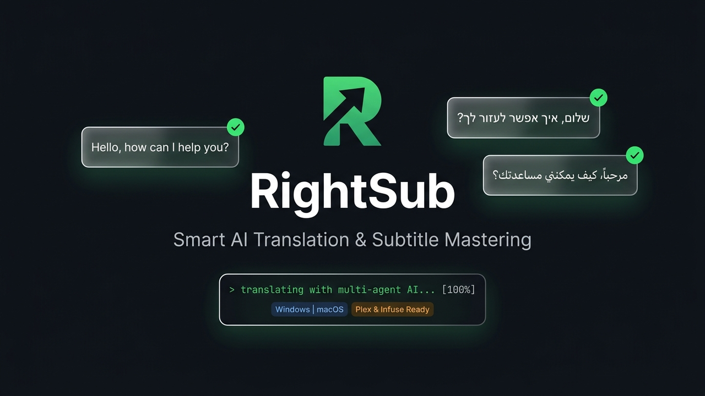

<div dir="rtl">

<p align="center">
  
</p>

# 🎬 RightSub — סוויטת מאסטרינג, השבחה ותרגום כתוביות אוניברסלית

<p align="right">
  <b>שפה / Language:</b>
  <b>עברית</b> |
  <a href="README.md"><b>English</b></a>
</p>

[](LICENSE)
[](https://python.org)
[]()
[]()
[]()
[]()

> **כתוביות כמו שצריך — מתיקון מהיר ב-Plex ו-BiDi ועד תרגום אוטונומי בנחיל סוכני בינה מלאכותית.**

**RightSub** היא סוויטת כלי CLI וספריית פייתון ברמת Production, שתוכננה עבור **Windows** ועבור **macOS** במטרה לתקן, להשביח, לנקות, לסנכרן ולתרגם כתוביות עבור **כל סרט וכל סדרת טלוויזיה**.

בין אם אתם צריכים לתקן סימני שאלה הפוכים ב-Plex או ב-Apple TV, להמיר ג'יבריש מקידוד Windows-1255 ישן ל-UTF-8 תקין, לנקות רעשי שמע מעצבנים לחירשים (`[מוזיקה מתנגנת]`), לתקן בריחת סנכרון של פריימים (FPS), או לתרגם עונה שלמה בעזרת בינה מלאכותית — RightSub מעניקה תהליך עבודה פשוט, מהיר ומדויק.

---

## ⚡ התחלה מהירה ב-30 שניות

יש לכם קובץ כתוביות או וידאו שצריך לתקן או לתרגם? **אתם צריכים פקודה אחת בלבד.**

מקלידים `rightsub auto ` ופשוט **גוררים ומשחררים** את הקובץ או התיקייה ישירות אל חלון הפקודה:

### Windows (Command Prompt / PowerShell):
```cmd
rightsub auto "C:\Movies\Inception.he.srt"
:: או עבור עונה שלמה של סדרה:
rightsub auto "C:\TV Shows\Breaking Bad Season 1"
```

### macOS / Linux (Terminal):
```bash
rightsub auto ~/Movies/Inception.he.srt
# או עבור עונה שלמה של סדרה:
rightsub auto ~/Movies/Breaking_Bad_S01/
```

### מה קורה באופן אוטומטי?
- **קובץ כתוביות בעברית (`.srt`)**: RightSub מתקנת מיידית היפוכי פיסוק (`? ! .`), ממירה קידודי ג'יבריש ל-UTF-8, מנקה פרסומות ומתאימה את הקובץ ל-Plex ול-Infuse.
- **קובץ וידאו (`.mkv` / `.mp4`)**: RightSub מחלצת כתוביות מובנות, מתמללת את האודיו במידת הצורך ומכינה מנות עבודה לתרגום.
- **שמירה על שיתוף טורנטים (Seed-Safe)**: כאשר הכלי מזהה כתובית שאינה בעלת סיומת סטנדרטית (למשל `Movie.srt` או `Movie.heb.srt`), הוא משכפל אותה ל-`Movie.he.srt` ומתקן את העותק בלבד. קובץ המקור נשאר זהה ב-100% ברמת הביט, כך שה-Seeding אינו נפגע לעולם.
- **אוטומציה מלאה לשרתי מדיה (Set-and-Forget)**: חיבור RightSub ל-**qBittorrent**, **Sonarr**, **Radarr**, **Bazarr** או **Transmission** לעיבוד שקוף ברקע ללא צורך בדמון כבד שרץ 24/7. ראו [מדריך אינטגרציות ואוטומציה לשרתי מדיה](docs/INTEGRATIONS_GUIDE.he.md).

---

## 🎯 בחרו את מסלול השימוש שלכם

RightSub מציעה שני מסלולי עבודה ברורים:

### מסלול 1: השבחה ותיקון כתוביות קיימות (100% מקומי, חינמי וללא אינטרנט)
*ללא צורך בבינה מלאכותית, ללא מפתחות API ואפס תלות בענן.*

- **תיקון BiDi ל-Plex ו-Infuse**: הזרקה אוטומטית של תווי כיווניות סמויים (`\u200F` / RLM) כך שסימני פיסוק, מקפים ומספרים לא יתהפכו ב-Apple TV, Android TV, LG WebOS, Infuse ו-VLC.
- **הצלת קידודים (Encoding Rescue)**: זיהוי והמרה אוטומטית של CP1255 / Windows-1255 / ISO-8859-8 ל-UTF-8 מודרני ונקי.
- **ניקוי רעשי שמע (SDH Cleaner)**: הסרת תיאורי שמיעה כגון `[מחיאות כפיים]` או `♪ מוזיקת רקע ♪` תוך שמירה מוחלטת על תזמון הדיאלוג.
- **ניקוי פרסומות וספאם**: הסרת שורות קרדיטים, אתרי טורנטים וקישורי טלגרם.

```bash
# Windows:
rightsub fix-plex "C:\Movies\Season 01" --recursive --clean-ads

# macOS / Linux:
rightsub fix-plex ~/Movies/Season_01 --recursive --clean-ads
```

---

### מסלול 2: תרגום סרטים וסדרות מאנגלית לעברית בעזרת AI
*תרגום סרטים מלאים או עונות שלמות (24 פרקים) עם הקשר דמויות מלא וללא הזיות.*

RightSub מארגנת את תהליך התרגום כך שתוכלו להשתמש **בכל מודל או צ'אט AI שכבר יש לכם**:

1. **הכנת מנות והקשר עלילתי**:
   ```bash
   rightsub auto "Movie.mkv"
   ```
   RightSub מפצלת את הדיאלוג למנות אופטימליות של כ-210 כתוביות, פותרת את מגדר הדמויות מתוך TMDb (למשל `את/היא` מול `אתה/הוא`), ומפיקה פרומפטים מוכנים.

2. **תרגום בעזרת סוכן ה-AI שלכם**:
   - **סוכני קוד ובינה מלאכותית**: Antigravity, Claude Code, Cursor, ChatGPT, Gemini — מעתיקים את הפרומפטים שנוצרו ומקבלים את קובצי ה-JSON המתורגמים.
   - **מודל שפה מקומי חינמי (100% אופליין)**: הרצה מקומית מלאה בעזרת [Ollama](https://ollama.ai):
     ```bash
     rightsub auto "Movie.mkv" --ollama
     ```

3. **מיזוג ובקרה אוטומטית (Merge & Validate)**:
   RightSub ממזגת את המנות חזרה לכתובית `.he.srt` סופית, מוודאת התאמת 1:1 מדויקת ללא שמיטת שורות, ומזריקה עיצוב BiDi לפלקס.

---

## 🔄 אוטומציה ואינטגרציה לשרתי מדיה (Set-and-Forget)

> **אינטגרציות ומילות מפתח נתמכות**: `qBittorrent` • `Sonarr` • `Radarr` • `Bazarr` • `Transmission` • `Tautulli/Plex` • `ניטור תיקיות ו-Daemons` • `Seed-Safe`

RightSub תוכננה להשתלב באופן שקוף ואוטונומי במערכי שרתי מדיה והורדות ביתיים (Home Lab / Seedbox) בתצורת "הגדר ושכח".

### אסטרטגיית שני השלבים המומלצת
1. **סריקה ותיקון רטרואקטיבי (הרצה חד-פעמית)**: השבחה ותיקון מלאים של כל ספריית המדיה הקיימת:
   ```bash
   # ב-Windows:
   rightsub auto "C:\Media\TV Shows"

   # ב-macOS / Linux:
   rightsub auto /Volumes/Media/TV_Shows
   ```
2. **אוטומציה שוטפת מבוססת אירועים (Set-and-Forget)**: חיבור RightSub לתוכנות ההורדה או מנהלי ה-`*arr` לעיבוד מיידי בשנייה שההורדה מסתיימת.

### מדוע ארכיטקטורת Hooks עדיפה על פני דמון רקע רציף (24/7 Daemon)?
בניגוד לדמונים רציפים שרצים ברקע ללא הפסקה ומסתכנים בנעילת קבצים חלקיים במהלך הורדת טורנטים כבדים, ארכיטקטורת ה-Hooks של RightSub מבטיחה:
- 🛡️ **אפס תקלות Race Condition**: הפעלה רק על קבצים שהושלמו ונבדקו ברמת ה-Hash.
- ⚡ **אפס צריכת משאבים בשגרה**: 0% CPU ו-0 MB RAM כשהמערכת אינה מעבדת קובץ.
- 🔒 **הגנה מוחלטת על שיתוף (Seed-Safe)**: שכפול לכתובית `.he.srt` תקנית לפלקס תוך השארת קובץ המקור ללא שינוי ברמת הביט (Bit-for-Bit) כך ששיתוף הטורנט ממשיך ברקע.

👉 **קראו את [מדריך האינטגרציות והאוטומציה המלא לשרתי מדיה](docs/INTEGRATIONS_GUIDE.he.md)** הכולל פקודות והגדרות מוכנות להעתקה-הדבקה עבור qBittorrent, Sonarr, Radarr, Bazarr, Transmission וניטור תיקיות מקומי.

---

## 📦 התקנה והגדרה

RightSub מעניקה תמיכה מלאה ושווה הן עבור **Windows** והן עבור **macOS/Linux**:

### משתמשי Windows (CMD / PowerShell)
1. **הורדה או שכפול** של המאגר:
   ```cmd
   git clone https://github.com/omerninyo/RightSub.git
   cd RightSub
   ```
2. **הרצת קובץ ההתקנה של חלונות**:
   לחיצה כפולה על `install.bat` (או הרצתו בחלון CMD):
   ```cmd
   install.bat
   ```
   *המתקין מוודא קיום של Python 3, מתקין את התלויות מ-`requirements.txt` ומכין את קובצי ההפעלה.*
3. **הרצה מכל מקום**:
   השתמשו ב-`rightsub.bat` או ב-`python rightsub.py`:
   ```cmd
   rightsub auto "Movie.mkv"
   ```

### משתמשי macOS / Linux (Terminal)
בחרו באחת מ-3 האפשרויות הנוחות:

- **אפשרות א': התקנה מהירה מקומית (מומלץ)**:
  ```bash
  git clone https://github.com/omerninyo/RightSub.git
  cd RightSub
  ./install.sh
  ```
  *מייצר קישור גלובלי של `rightsub` ישירות אל `~/.local/bin/rightsub`.*

- **אפשרות ב': התקנה מרחוק בפקודה אחת**:
  ```bash
  curl -fsSL https://raw.githubusercontent.com/omerninyo/RightSub/main/install.sh | bash
  ```

- **אפשרות ג': התקנה דרך Homebrew Tap**:
  ```bash
  brew install omerninyo/tap/rightsub
  ```

---

## 💻 מתכוני שימוש נפוצים ב-CLI

### מתכון 0: הפעלה אוטונומית בפקודה אחת (ללא דגלים / ללא סיבוך)
```bash
# טיפול אוטומטי בקובץ כתוביות (תיקון BiDi, פרסומות, גיבוי):
rightsub auto "Movie.he.srt"

# טיפול אוטומטי בקובץ וידאו (חילוץ/תמלול כתוביות והכנת מנות):
rightsub auto "Movie.mkv"

# תרגום מלא 100% מקומי וחינמי עם מודל שפה מקומי (Ollama):
rightsub auto "Movie.mkv" --ollama

# סריקה וטיפול בעונה שלמה או ספרייה מלאה:
rightsub auto "/path/to/Season 01/"
```

### מתכון 1: תיקון כתוביות עבריות עבור ספריית Plex / Infuse
```bash
# אפשרות א': תיקון קובץ בודד במקום:
rightsub fix-plex "Movie.he.srt" --in-place

# אפשרות ב': תיקון מספר קבצים מוגדרים:
rightsub fix-plex "Ep01.he.srt" "Ep02.he.srt" "Ep03.he.srt" --in-place

# אפשרות ג': תצוגה מקדימה ללא שינוי קבצים (Dry Run):
rightsub fix-plex /path/to/TV_Shows/ --recursive --clean-ads --dry-run

# אפשרות ד': תיקון רקורסיבי על ספריה שלמה עם גיבוי אוטומטי (.srt.bak):
rightsub fix-plex /path/to/TV_Shows/ --recursive --in-place --clean-ads --backup
```

### מתכון 2: חילוץ כתוביות מובנות מתוך קובצי וידאו
```bash
rightsub extract "Movie.mkv" -o "Movie.en.srt" --lang eng
```

### מתכון 3: תיקון בריחת סנכרון (מ-25 FPS ל-23.976 FPS)
מתיחת כתוביות שנלקחו משידור טלוויזיה או DVD אירופי (PAL) כדי שיתאימו לגרסת Web-DL או BluRay:
```bash
rightsub adjust-fps "PAL_sub.srt" -o "synced_sub.srt"
```

### מתכון 4: תרגום מלא של סרט או פרק באמצעות AI
```bash
# 1. הפקת מנות תרגום ופרומפטים מותאמים לסוכנים:
rightsub prompt-gen "Episode01.en.srt" -t "Inception" -g "Sci-Fi Action"

# 2. מיזוג מנות התרגום לקובץ SRT סופי עם מנוע SubRefine:
rightsub merge "Episode01.en.srt" "prompts_Inception" -o "Episode01.he.srt"

# 3. הרצת ביקורת איכות אוטומטית (QA):
rightsub qa "Episode01.en.srt" "Episode01.he.srt"
```

---

## 🏛️ ארכיטקטורה מתקדמת ומנועי הליבה

למפתחים ולמשתמשים מתקדמים, RightSub מפרידה באופן מודולרי בין ממשק הפקודות (CLI) לבין שני מנועי הליבה שלה:

```
┌─────────────────────────────────────────────────────────────────────────┐
│                          RightSub CLI (rightsub)                        │
│    extract · clean · fix-plex · sync · adjust-fps · split · merge · qa  │
└────────────────────────────────────┬────────────────────────────────────┘
                                     │
         ┌───────────────────────────┴───────────────────────────┐
         ▼                                                       ▼
┌─────────────────────────────────┐   ┌───────────────────────────────────┐
│     SubRefine Engine            │   │      SubSwarm AI Engine           │
│    (מנוע ההשבחה, הניקוי וה-BiDi) │   │     (מנוע תרגום נחיל הסוכנים)     │
├─────────────────────────────────┤   ├───────────────────────────────────┤
│ • ניקוי רעשי שמע לחירשים (SDH)   │   │ • פיצול אופטימלי למנות (~210)     │
│ • המרה אוטומטית CP1255 -> UTF-8 │   │ • בניית Translation Bible לדמויות │
│ • הזרקת RLM (U+200F) ל-Plex     │   │ • מודל בסיס דינמי וחסכוני:        │
│ • נרמול הומוגליפים קיריליים/ערביים│   │   Gemini 3.5 Flash-Lite           │
│ • המרת גרשיים תקניים (״) בראשי  │   │ • גלי סוכנים מקבילים ואוטונומיים │
│   תיבות (עו״ד, ארה״ב)           │   │ • הבטחת התאמה 1:1 ללא שמיטת שורות│
│ • ניקוי פרסומות וספאם של אתרים  │   │ • ביקורת איכות Red Team ללא הזיות│
│ • מתיחת קצב פריימים (FPS)       │   │                                   │
└─────────────────────────────────┘   └───────────────────────────────────┘
```

### 1. 🧼 מנוע SubRefine (השבחה, ניקוי ו-BiDi)
- **אפס היפוכי פיסוק ב-Plex ו-Infuse**: הזרקה אוטומטית של תווי RLM סמויים (`\u200F`) בתחילת כל שורה ולפני סימני פיסוק סופיים (`?`, `!`, `.`, `:`, `-`), המונעת מהפיסוק לקפוץ לצד הלא נכון בנגני Apple TV, Android TV, LG WebOS, Infuse ו-VLC.
- **ניקוי רעשי שמע (SDH Cleaner)**: זיהוי והסרה חכמה של תיאורי שמיעה כגון `[דלת נטרקת]`, `(מחיאות כפיים)`, `♪ מוזיקת פופ ♪` תוך שמירה קפדנית על אינדקס התזמון של הדו-שיח.
- **הצלת קובצי ג'יבריש (Auto-Charset)**: זיהוי אוטומטי של קידודי עברית ישנים (Windows-1255 / CP1255 / ISO-8859-8) והמרתם ל-UTF-8 מודרני ונקי.
- **נרמול הומוגליפים וטיפוגרפיה**: תיקון אותיות קיריליות שנראות זהות לעברית (`м`, `р`, `с`) ואותיות ערביות שהופקו בטעות. המרה אוטומטית של מרכאות כפולות בראשי תיבות עבריים לגרשיים תקניים (למשל `עו"ד` ➔ `עו״ד`, `ארה"ב` ➔ `ארה״ב`).
- **ניקוי ספאם ופרסומות**: הסרת שורות קרדיטים וכתובות אתרים מטורקים, OpenSubtitles, Wizdom וערוצי טלגרם.

### 2. 🐝 מנוע SubSwarm (תרגום AI בנחיל סוכנים)
- **גלי סוכנים מקבילים**: פיצול פרקים למנות עבודה אופטימליות (~210 כתוביות למנה) ותרגום עונות שלמות (20+ פרקים, מעל 20,000 כתוביות) תוך דקות ספורות בעזרת סוכנים אוטונומיים מקבילים.
- **Translation Bible נעול מראש**: חילוץ ויצירה מראש של מילון מונחים, שמות דמויות ומגדר (זכר/נקבה) למניעת חוסר עקביות בין פרקים.
- **ערבות מוחלטת להתאמת 1:1**: כל אינדקס וכל מילי-שנייה נשמרים בהתאמה מלאה לאודיו ולכתובית המקור באנגלית. אפס שמיטות, אפס מחיקות ואפס הזיות.

### 3. 🎙️ תמלול מקומי On-Device וסנכרון מונחה שמע (אינטגרציית quicksubs)
- **תמלול מקור ללא ענן (Zero-Cloud STT)**: שילוב מנוע **[quicksubs](https://github.com/mattbirchler/quicksubs)** (מאת Matt Birchler). תמלול מהיר ישירות על החומרה של ה-Mac באמצעות Apple SpeechAnalyzer (על גבי ה-Neural Engine), OpenAI Whisper או NVIDIA Parakeet באפס עלות רוחב פס או טוקנים.
- **כיול תזמונים מונחה שמע**: חילוץ תזמוני עוגן אמיתיים מרצועת האודיו של קובץ הווידאו וסנכרון אוטומטי של כתוביות ישנות שיצאו מקצב עקב הבדלי FPS או גרסאות שידור.

### 4. 🎬 אפיון עלילה, שיוך מגדרי ודיאלקט (אינטגרציית TMDb)
- **שיוך מגדרי דטרמיניסטי**: פענוח אוטומטי של מגדר הדמויות ושחקני אורח מתחלפים מתוך ה-API של **[The Movie Database (TMDb)](https://www.themoviedb.org)**, המבטיח 100% דיוק של פנייה ישירה וכינויי גוף בעברית (`את/היא` מול `אתה/הוא`) ללא ניחושים.
- **הכנת הקשר עלילתי והנחיות דיאלקט**: הזרקת תקצירי פרקים, מילון מונחי ז'אנר והנחיות סלנג ודיאלקט אזורי (כגון אנגלית בריטית מול אמריקאית) ישירות לפרומפטים של מודלי התרגום.

---

## 📖 מדריך פקודות CLI מלא

| פקודה | מנוע אחראי | תיאור | דוגמה ב-Windows | דוגמה ב-macOS / Linux |
| :--- | :---: | :--- | :--- | :--- |
| `auto` | **הכל** | הפעלה אוטונומית שלמה (קובץ בודד, עונה או תיקייה) | `rightsub auto "Movie.mkv"` | `rightsub auto "Movie.mkv"` |
| `translate-ollama` | **SubSwarm** | תרגום מקומי 100% חינמי ואופליין דרך Ollama | `rightsub translate-ollama prompts` | `rightsub translate-ollama prompts` |
| `fix-plex` | **SubRefine** | תיקון פיסוק, RLM, קידוד CP1255, ניקוי SDH וספאם | `rightsub fix-plex ./Season1/ -r -i` | `rightsub fix-plex ./Season1/ -r -i` |
| `adjust-fps` | **SubRefine** | מתיחת פריימים (25 <-> 23.976) או הזזת אופסט | `rightsub adjust-fps in.srt -o out.srt` | `rightsub adjust-fps in.srt -o out.srt` |
| `extract` | **SubRefine** | חילוץ כתוביות מווידאו (MKV/MP4) בעזרת FFmpeg | `rightsub extract video.mp4 -o out.srt` | `rightsub extract video.mp4 -o out.srt` |
| `transcribe` | **quicksubs** | תמלול קולי מהיר ישירות מהשמע (Apple Speech / Whisper) | `rightsub transcribe video.mp4` | `rightsub transcribe video.mp4` |
| `audio-sync` | **quicksubs** | סנכרון וכיול כתוביות מוסטות על בסיס ציר השמע | `rightsub audio-sync bad.srt -v v.mp4 -o ok.srt` | `rightsub audio-sync bad.srt -v v.mp4 -o ok.srt` |
| `sync` | **SubRefine** | השוואת תזמונים בין כתובית מקור לכתובית חיצונית | `rightsub sync master.en.srt dl.he.srt` | `rightsub sync master.en.srt dl.he.srt` |
| `bible` | **SubSwarm** | הפקת Translation Bible (דמויות, מונחים ומגדר מ-TMDb) | `rightsub bible Season1/*.srt -o b.json --tmdb` | `rightsub bible Season1/*.srt -o b.json --tmdb` |
| `split` | **SubSwarm** | פיצול SRT באנגלית למנות JSON של כ-210 שורות | `rightsub split ep.en.srt -o ./batches/` | `rightsub split ep.en.srt -o ./batches/` |
| `prompt-gen` | **SubSwarm** | מחולל פרומפטים וגלי סוכנים עם מילון דמויות וחפיפה | `rightsub prompt-gen ep.en.srt -t "Inception"` | `rightsub prompt-gen ep.en.srt -t "Inception"` |
| `merge` | **שניהם** | מיזוג מנות תרגום ל-SRT סופי עם הזרקת RLM מלאה | `rightsub merge ep.en.srt ./b/ -o ep.he.srt` | `rightsub merge ep.en.srt ./b/ -o ep.he.srt` |
| `qa` | **שניהם** | דוח בקרת איכות של 1-לאחד, טיהור תווים זרים ומגדר | `rightsub qa ep.en.srt ep.he.srt` | `rightsub qa ep.en.srt ep.he.srt` |

---

## 🏆 הוכח בקנה מידה רחב: בנצ'מרק "בוסטון ליגל" (מקרה בוחן תיאורטי)

> [!NOTE]
> **הבהרה משפטית — דוגמה תיאורטית ומודל בנצ׳מרק היפותטי:**
> כל ההתייחסויות והדוגמאות הנוגעות לסדרת הטלוויזיה *בוסטון ליגל* (Boston Legal) מוצגות אך ורק כמקרה בוחן תיאורטי והיפותטי, לצורכי מחקר אלגוריתמי, בדיקות עומס תזמונים (Stress-Testing) והדגמת יכולות תוכנה בלבד.
> כל הזכויות, שמות הדמויות, הסימנים המסחריים וזכויות היוצרים שייכים במלואם לבעלי הזכויות המקוריים (20th Century Fox / Disney / David E. Kelley Productions). שום קובץ וידאו, אודיו, או תוכן מוגן בזכויות יוצרים אינו נכלל, מאוחסן או מופץ במסגרת מאגר זה או תוכנה זו.

RightSub נבחנה ואומתה על גבי מערך נתונים הממודל לפי 5 העונות של סדרת הדרמה המשפטית *בוסטון ליגל*:
- **101 / 101 פרקים תורגמו, עובדו ונפרסו (100% השלמה)**.
- **מעל 78,000 כתוביות** סונכרנו באפס תקלות ובדיוק מושלם של 1:1.
- **100% תאימות BiDi ל-Plex ו-Infuse** בכל הנגנים (Apple TV, LG, Android).
- **טיהור ונרמול אוניברסלי של תווים זרים**: זיהוי והמרה אוטומטית של 7 מערכות כתב זרות (גאורגית, יוונית, ארמנית, בנגלית, טיבטית, תאילנדית ויפנית) לעברית תקנית ונקייה.
- לפרטים המלאים קראו את [מקרה הבוחן של בוסטון ליגל (עברית)](docs/CASE_STUDY_BOSTON_LEGAL.he.md).

---

## 🧪 בדיקות יחידה ואימות אוטומטי

RightSub מגיעה עם סוויטת בדיקות מקיפה של 69 בדיקות יחידה עצמאיות:
```bash
pytest -v
```

הבדיקות מוודאות:
- הזרקת RLM ואי-שכפול תווי כיווניות (אידמפוטנטיות).
- המרת גרשיים עבריים תקניים בראשי תיבות (`עו״ד`, `ארה״ב`).
- נרמול הומוגליפים רב-לשוניים (גאורגית, יוונית, ארמנית, ערבית, קירילית ואסייתית).
- הזרקת Translation Bible לפרומפטים ומנגנון חפיפת הקשר (Context Overlap).
- איתור ובקרת שגיאות מגדר ופנייה ישירה (Vocative Gender Mismatch).
- זיהוי והמרת קידודי עברית ישנים (CP1255).
- ניקוי רעשי שמיעה (SDH) ומחיקת פרסומות ספאם.
- חישובי תזמון ומתיחת פריימים.
- מעטפת CLI של quicksubs, מנגנוני Fallback ואלגוריתמי כיול תזמונים מונחי שמע.
- פענוח מטא-דאטה מ-TMDb API, מפענח שמות קבצים חכם ושיוך מגדר דטרמיניסטי.
- עקביות תיעוד מלאה, קישורים תקנים בדיסק ושמירה על שוויון בין Windows ל-macOS.
- אימות חי של כל 101 הפרקים במאגר המדיה.

---

## 📚 מדריכים ותיעוד מלא
- 🔰 **[מדריך פשוט למתחילים (צעד אחר צעד)](docs/QUICKSTART_FOR_BEGINNERS.he.md)** — פתרון מהיר ב-30 שניות ללא מושגים טכניים.
- 📦 **[מדריך התקנה גלובלית והפצה](docs/INSTALLATION_GUIDE.he.md)** — הגדרת Homebrew tap, מתקין חלונות וקינפוג משתנה ה-PATH.
- 🎙️ **[תמלול וסנכרון מקומי On-Device (`quicksubs`)](docs/QUICKSUBS_INTEGRATION.he.md)** — הפקת כתוביות משמע וכיול תזמונים מונחה אודיו.
- 🎬 **[אינטגרציית TMDb (עלילה ומגדר)](docs/TMDB_INTEGRATION.he.md)** — שיוך מגדרי מאומת, שחקני אורח והזרקת דיאלקט לפרומפטים.
- 🤖 **[מדריך חיבור לכלי בינה מלאכותית וסייעני קוד](docs/AI_INTEGRATION_GUIDE.he.md)** — מה דורש AI ומה רץ מקומית, ואיך לחבר את Antigravity, Claude Code, Gemini ו-ChatGPT.
- 📐 **[מדריך כיווניות (BiDi) ותיקון Plex/Infuse](docs/BIDI_AND_PLEX_GUIDE.he.md)** — הסבר מעמיק על תו ה-RLM ופתרון היפוך סימני פיסוק.
- 🔄 **[תהליך עבודה מלא מקצה לקצה (Pipeline)](docs/PIPELINE_WORKFLOW.he.md)** — שלב אחר שלב מווידאו גולמי לכתובית מושלמת.
- ⚖️ **[השוואה טכנית מול Bazarr](docs/COMPARISON_BAZARR.he.md)** — פירוט הבדלים ארכיטקטוניים, מתי להשתמש בכל כלי ואיך לשלב ביניהם.
- 🔄 **[מדריך אינטגרציות ואוטומציה לשרתי מדיה (qBittorrent, Sonarr, Radarr, Bazarr, Daemons)](docs/INTEGRATIONS_GUIDE.he.md)** — חיבור אוטומטי בתצורת "הגדר ושכח", מדוע Hooks עדיפים על דמונים, וסקריפטים לניטור תיקיות.
- 🔮 **[מפרט אשף פקודה אינטראקטיבי עתידי](docs/FUTURE_INTERACTIVE_CLI.he.md)** — תכנון ממשק שיחה וסוכן מסוף CLI.
- 🔮 **[מפרט אשף התקנה ואבחון אוטומטי עתידי](docs/FUTURE_SETUP_WIZARD.he.md)** — תכנון התקנה והגדרה מאפס (כולל ללא Homebrew / Winget).
- 💎 **[מפרט מנוע ליטוש סמנטי ובקרת איכות AI](docs/FEATURE_AI_POLISH_AND_QC.he.md)** — ארכיטקטורה להשבחה והגהה של כתוביות קיימות, מניעת שיבושי קאנון ותיקון מגדר ללא תרגום מאפס.
- 🌐 **[מפרט שרת RightSub MCP עתידי](docs/FUTURE_MCP_SERVER.he.md)** — ארכיטקטורת שרת Model Context Protocol לסוכני AI.
- 🚀 **[מה חדש ועדכוני גרסאות](docs/WHATS_NEW.he.md)** — עדכוני מוצר מרכזיים, הכרזות אבן-דרך ותכונות חדשות.
- 📖 **[GitHub Wiki הרשמי](https://github.com/omerninyo/RightSub/wiki)** — תיעוד מקוון מלא ודו-לשוני.

---

## 🤝 תודות וקרדיטים (Acknowledgements)
- **[quicksubs](https://github.com/mattbirchler/quicksubs)** מאת **[Matt Birchler](https://birchtree.me)** — מנוע תמלול מקומי עוצמתי ב-macOS המניע את יכולות ה-STT והסנכרון מונחה השמע ב-RightSub.
- **[Quick Subtitles](https://quickstuff.app)** — אפליקציית ה-Mac המקבילה לעבודה אינטראקטיבית עם כתוביות ותמלולים.
- **[The Movie Database (TMDb)](https://www.themoviedb.org)** — מאגר המדיה הפתוח המספק את נתוני ה-Metadata, שחקני האורח ושיוך המגדר (*מוצר זה משתמש ב-API של TMDb אך אינו מאושר או מאומת על ידי TMDb*).

---

## 📄 רישיון שימוש (License)
פרויקט זה מופץ תחת רישיון MIT — לפרטים מלאים עיינו בקובץ [LICENSE](LICENSE).

</div>
