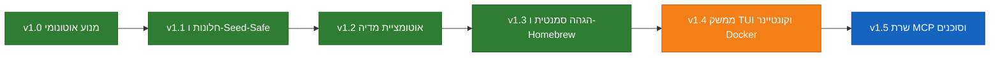

# 🗺️ מפת דרכים ומעקב אבני-דרך — RightSub (Product Roadmap)

  <b>שפה / Language:</b>
  <b>עברית</b> |
  <a href="ROADMAP.md"><b>English</b></a>

ברוכים הבאים למפת הדרכים הרשמית של **RightSub**. מסמך זה מרכז את אבני-הדרך שהושלמו, סדרי העדיפויות הנוכחיים והיוזמות הארכיטקטוניות המתוכננות עבור מערך הכתוביות האוניברסלי.

---

## 🧭 סקירת התפתחות גרסאות (Milestone Progression)

---

## 🟢 גרסאות ששוחררו (Production Stable)

### 🌟 [גרסה 1.3.0](https://github.com/omerninyo/RightSub/releases/tag/v1.3.0) — הגהה סמנטית, הפצת Bottle אוניברסלי ב-Homebrew ואשף אבחון
> **תאריך שחרור:** ספטמבר 2026  
> **יכולות מפתח:**
- [x] **הגהה ובקרת איכות סמנטית (`rightsub polish`)**: מנוע ליטוש אוטונומי לכתוביות קיימות על בסיס עקרון מרחק עריכה מינימלי (שימור 85%–90%).
- [x] **מנוע ידע היררכי (Hierarchical Domain Knowledge)**: סיווג חכם תלת-שלבי (`domain_knowledge.py`) עם חבילות ז'אנר ייעודיות ואימות עוגן דו-לשוני (**Bilingual Anchor Validation**).
- [x] **הגנת זליגת ציפייה (Forward Anticipation Drift Guard)**: פיצול קיוסים מורכבים (`split_part`) ובלימת מודל השפה מהקדמת שורות דיאלוג עתידיות.
- [x] **סנכרון חותמות זמן לכונני רשת (SMB/NAS)**: שטיפת מטא-דאטה מאולצת (`os.utime`) המונעת מלקוחות SMB ב-macOS ליפול לאפוק 2001.
- [x] **חבילת Homebrew Tap רשמית (`omerninyo/tap`)**: בקבוקים מוכנים מראש (`:all`) להתקנה בשנייה אחת על מעבדי Apple Silicon ו-Intel ללא תלות ב-Xcode.
- [x] **אשף הגדרות מהיר ואבחון בריאות מערכת**: פקודות `rightsub config` (הגדרת מפתחות ב-10 שניות) ו-`rightsub doctor` (בדיקת תלויות וסביבה).

### 🌟 [גרסה 1.2.0](https://github.com/omerninyo/RightSub/releases/tag/v1.2.0) — מערך אוטומציה לשרתי מדיה והתקנה במחשב נקי
> **תאריך שחרור:** ספטמבר 2026  
> **יכולות מפתח:**
- [x] **חיבורי מדיה מונחי אירועים (Event-Driven Hooks)**: חיבורים נקיים ובדוקים עבור qBittorrent, Sonarr, Radarr, Bazarr, Transmission ו-Tautulli/Plex.
- [x] **ארכיטקטורה ללא דמון רקע**: הוכחת 0% CPU ו-0 MB RAM במנוחה בהשוואה לדמונים כבדים.
- [x] **מדריכי התקנה מאפס**: תמיכה מלאה בהתקנה במחשבים נקיים ללא מנהלי חבילות.

### 🌟 [גרסה 1.1.0](https://github.com/omerninyo/RightSub/releases/tag/v1.1.0) — שוויון מלא ל-Windows וארכיטקטורת Seed-Safe
> **תאריך שחרור:** ספטמבר 2026  
> **יכולות מפתח:**
- [x] **תאימות מלאה לחלונות**: `rightsub.bat`, בדיקות בסביבת PowerShell והצלת קידוד Windows-1255.
- [x] **ארכיטקטורת Seed-Safe**: יצירת כתוביות צמודות ללא נגיעה בקובצי המקור בטורנטים פעילים.

### 🌟 [גרסה 1.0.0](https://github.com/omerninyo/RightSub/releases/tag/v1.0.0) — המנוע האוטונומי (`rightsub auto`)
> **תאריך שחרור:** ספטמבר 2026  
> **יכולות מפתח:**
- [x] **צינור עיבוד אוטונומי בפקודה אחת**: גילוי רצועות מוטמעות, חילוץ פרטי עלילה מ-TMDb והפקת פרומפטים.
- [x] **מנוע SubRefine**: תיקון פיסוק הפוך (BiDi RLM) ל-Plex/Infuse, ניקוי פרסומות ורעשי שמע (SDH).
- [x] **מנוע SubSwarm**: תזמור תרגום מרובה מנות בעזרת AI עם נעילת Translation Bible.

---

## 🟡 היעד הבא — גרסה 1.4.0: ממשק טרמינל אינטראקטיבי (TUI), חיבורי שרתים וקונטיינרים (Docker)

> **יעד שחרור משוער:** רבעון רביעי 2026  
> **מיילסטון ב-GitHub:** [`v1.4.0 — Interactive Terminal Experience (TUI) & Containers`](https://github.com/omerninyo/RightSub/milestones)  
> **מסמכי מפרט (RFC):**
> - [RFC 001: ממשק טרמינל אינטראקטיבי (TUI)](docs/proposals/RFC_001_INTERACTIVE_TUI.he.md)
> - [RFC 003: אשף התקנה ואבחון אוטונומי](docs/proposals/RFC_003_SYSTEM_INTEGRATION_WIZARD.he.md)
> - [RFC 004: שרת Webhook וקונטיינר Docker לחיבור Sonarr, Radarr ו-Bazarr](docs/proposals/RFC_004_DOCKER_WEBHOOK_SERVER.he.md)

### תכונות מתוכננות:
- [ ] **ממשק TUI לסריקה ואישור שינויים (`rightsub polish --interactive`)** ([#1](https://github.com/omerninyo/RightSub/issues/1)):
  - ממשק טרמינל במסך מלא (מבוסס `rich` או `curses`) למעבר שורה-אחר-שורה על השינויים המוצעים.
  - קיצורי מקלדת נוחים (`[Y] אשר`, `[N] דחה`, `[E] ערוך ידנית`, `[A] אשר הכל`).
  - סייר קבצים בטרמינל לבחירת פרקים ספציפיים בסדרות כבדות עם מבנה תיקיות מורכב.
- [ ] **מתקין אוטומטי לחיבורי תוכנות הורדה ומעטפת שירות** ([#2](https://github.com/omerninyo/RightSub/issues/2)):
  - פקודת `rightsub config --install-hooks`: זיהוי אוטומטי של תוכנות הורדה מותקנות (qBittorrent, Sonarr, Radarr) והגדרת סקריפטי הסיום באופן אוטונומי.
  - יצירת שירותי systemd (בלינוקס) ו-launchd (ב-macOS) עבור שרתי מדיה מרוחקים הדורשים סריקת תיקיות אוטומטית.
- [ ] **תמיכה רשמית בקונטיינרים (Official Docker & Sidecar Container Support)**:
  - **אימג' רשמי ב-GitHub Container Registry (`ghcr.io/omerninyo/rightsub`)**: אימג' רזה מבוסס Python/Debian הכולל את כל התלויות, ספריות הקידוד ו-ffmpeg ללא צורך בהתקנה על המארח.
  - **תמיכה במצב כפול (Dual Mode: CLI vs. Watcher)**:
    - *CLI One-Shot:* הרצה לפי דרישה מתוך טרמינל או סקריפטים: `docker run --rm -v /media:/media ghcr.io/omerninyo/rightsub auto /media/movie.srt`.
    - *Directory Watcher (Sidecar):* קונטיינר רקע קל-משקל המאזין לתיקיות הורדה (`/media/downloads`) באמצעות `watchdog` ומאסטר אוטומטית כל כתובית חדשה שנוצרת על ידי Bazarr או תוכנת טורנטים.
  - **אינטגרציה ל-NAS (Unraid / TrueNAS SCALE / Synology)**: תבנית מוכנה (`docker-compose.yml`) וקובץ תבנית ל-Unraid Community Apps להתקנה בלחיצה אחת.

---

## 🔵 באופק — גרסה 1.5.0: שרת MCP ופרוטוקול סוכני AI

> **יעד שחרור משוער:** רבעון ראשון 2027  
> **מיילסטון ב-GitHub:** [`v1.5.0 — Agentic Subtitle Protocol & MCP Server`](https://github.com/omerninyo/RightSub/milestone/2)  
> **מסמך מפרט (RFC):**
> - [RFC 002: שרת RightSub MCP ייעודי](docs/proposals/RFC_002_MCP_SERVER.he.md)

### תכונות מתוכננות:
- [ ] **שרת MCP רשמי (`rightsub mcp`)** ([#3](https://github.com/omerninyo/RightSub/issues/3)):
  - תקשורת JSON-RPC מקומית מעל `stdio` עבור יישומי **Claude Desktop**, **Antigravity**, **Cursor**, **Windsurf**, ו-**ChatGPT Desktop**.
  - חשיפת כלי בדיקת מדיה (`inspect_media`), חילוץ כתוביות, תיקון פיסוק והגהת כתוביות ישירות לסוכנים.
- [ ] **שליטה במדיה בשפה טבעית**:
  - מאפשר לסוכן AI לשוחח עם המשתמש, לבדוק את איכות הכתוביות ולהחיל תיקונים מתוך חלון הצ'אט.
- [ ] **הזרמת תרגום בזמן אמת (Streaming)**:
  - תרגום שורה-אחר-שורה בסטרימינג ישיר לבדיקה מהירה ותצוגה מקדימה.

---

## 🟣 רעיונות למחקר עתידי ו-Backlog קהילתי

רעיונות הנמצאים בבדיקה וממתינים למשוב מהקהילה:
- **דשבורד Web UI מקומי**: ממשק דפדפן פשוט וקל-משקל (FastAPI / HTML5) לניהול ויזואלי של ספריית הכתוביות.
- **תמיכה רב-לשונית**: הרחבת מנגנוני ה-BiDi של SubRefine לשפות נוספות (ערבית, פרסית, ומשפחת הכתב הקירילי).
- **אימון מודל Whisper ייעודי לשמע בעברית**: כיול מודל אקוסטי מותאם לעברית לצורך תמלול שמע וסנכרון תזמונים מדויק ברמת המילי-שנייה.

---

## 📋 ניהול מפת הדרכים (Roadmap Governance)

- **הצעת רעיונות חדשים**:
  1. פתיחת דיון (Discussion) או Issue ב-GitHub.
  2. עבור תכונות מורכבות, כתיבת מפרט RFC תחת `docs/proposals/RFC_XXX_<TITLE>.md`.
  3. לאחר אישור, הרעיון משובץ ל-Milestone ייעודי ומתווסף למסמך מפת דרכים זה.
- **שלבי מחזור החיים**:
  - `Proposed`: הצעת RFC בבחינה.
  - `Planned`: מחויב לאבן-דרך רשמית בגרסה עתידית.
  - `In Progress`: בפיתוח פעיל ובדיקות יחידה.
  - `Shipped`: מוזג לענף `main`, נארז ב-Homebrew Bottle ותועד ב-`WHATS_NEW`.

