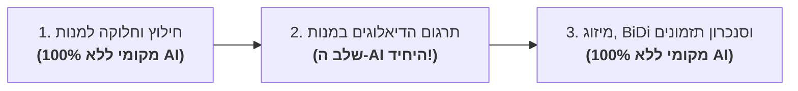

<div dir="rtl">

# 🤖 מדריך חיבור לכלי בינה מלאכותית וסייעני קוד (AI Integration Guide)

<p align="right">
  <b>שפה / Language:</b>
  <b>עברית</b> |
  <a href="AI_INTEGRATION_GUIDE.md"><b>English</b></a>
</p>

ברוכים הבאים למדריך החיבור והאינטגרציה של **RightSub** עם כלי בינה מלאכותית (AI) וסייעני קוד מודרניים (Google Antigravity, Claude Code, Gemini CLI / Cloud Code, ChatGPT, Cursor ועוד).

מדריך זה נכתב בצורה הפשוטה והברורה ביותר כדי שכל משתמש יוכל להפיק את המרב מהמערכת, גם ללא ידע מוקדם בפיתוח או ב-API.

---

## 🛑 הבהרת יסוד קריטית: מה בכלל דורש בינה מלאכותית ומה עובד 100% מקומית?

לפני שמתחברים לכלי AI כלשהו, **חשוב לדעת שרוב הפעולות ב-RightSub אינן זקוקות לבינה מלאכותית כלל!**

### 💻 מה עובד 100% מקומית, ללא AI, ללא אינטרנט ובחינם לחלוטין? (מנוע SubRefine)
7 מתוך 8 פקודות המערכת רצות ישירות על המעבד של המחשב שלכם, מסתיימות תוך שבריר שנייה, ואינן דורשות שום חיבור לרשת או מודל שפה:

| פעולה מקומית | פקודת ה-CLI | האם דורש AI? |
| :--- | :--- | :---: |
| **חילוץ כתוביות מתוך סרטי MKV/MP4** | `./rightsub extract` | ❌ **ללא AI** (מבוצע ע"י FFmpeg) |
| **תיקון סימני פיסוק הפוכים לפלקס ו-BiDi** | `./rightsub fix-plex` | ❌ **ללא AI** (אלגוריתם יוניקוד RLM) |
| **המרת ג'יבריש (קידודי CP1255 ישנים ל-UTF-8)** | `./rightsub fix-plex` | ❌ **ללא AI** (מפענח קידוד אוטומטי) |
| **מחיקת פרסומות ורעשי רקע (SDH)** | `./rightsub fix-plex --clean-ads` | ❌ **ללא AI** (מסנן Regex דטרמיניסטי) |
| **תיקון בריחת סנכרון פריימים (25 ⟷ 23.976 FPS)** | `./rightsub adjust-fps` | ❌ **ללא AI** (חישוב מתיחה מתמטי) |
| **השוואת תזמונים ובדיקת הפרשי דלתא** | `./rightsub sync` | ❌ **ללא AI** (השוואת חותמות זמן) |
| **חלוקת כתובית אנגלית למנות תרגום קטנות** | `./rightsub split` / `prompt-gen` | ❌ **ללא AI** (חלוקה אלגוריתמית) |
| **איחוד מנות מתורגמות ל-SRT סופי מושלם** | `./rightsub merge` | ❌ **ללא AI** (חיבור תזמונים והזרקת RLM) |
| **ביקורת איכות סופית (QA)** | `./rightsub qa` | ❌ **ללא AI** (ספירה ובדיקת התאמה 1:1) |

---

### 🧠 מה הדבר היחיד שכן דורש בינה מלאכותית? (מנוע SubSwarm)
**תרגום שורות הדיאלוג עצמן מאנגלית לעברית.**  
תרגום איכותי של סרטים וסדרות דורש הבנת הקשר, הומור, משחקי מילים, זיהוי סלנג ושמירה על מגדר הדמויות (פנייה לגבר/אישה). כאן בדיוק נכנס מנוע **SubSwarm**, שנעזר במודלי בינה מלאכותית כדי לתרגם את מנות הטקסט ברמה ספרותית.



---

## 📦 כיצד עובד מנגנון המנות (The Batch Mechanism)?

כשאתם רוצים לתרגם סרט או פרק, אתם מריצים פקודה אחת שמכינה את כל החומרים:
```bash
./rightsub prompt-gen "Movie.en.srt" -t "שם הסרט"
```
הפקודה יוצרת תיקייה בשם `prompts_שם הסרט/` המכילה:
- `batch_01_prompt.txt`: הפרומפט עם כללי התרגום והעלילה.
- `batch_01_input.json`: רשימת השורות באנגלית עם מפתחות מספריים (למשל `"1": "Hello", "2": "How are you?"`).

כל מה שכלי ה-AI שלכם צריך לעשות זה להחזיר קובץ תרגום תואם בשם:
`batch_01_translated.json`
במבנה המדויק:
```json
{
  "1": "שלום",
  "2": "מה שלומך?"
}
```

---

## 🛠️ מדריכי הפעלה לפי כלי AI פופולריים

בחרו את הכלי שבו אתם עובדים ופעלו לפי ההוראות הפשוטות:

### 1. Google Antigravity (סביבת ברירת המחדל — מומלץ ביותר)
**Google Antigravity** היא סביבת העבודה הראשית שעבורה נבנה RightSub. היא תומכת בהפעלת סוכנים אוטונומיים במקביל.

#### איך מפעילים?
בחלון השיחה של Antigravity, פשוט כותבים בקשה שיחתית רגילה:
> *"אנא השתמש ב-RightSub כדי לחלץ את הכתוביות מתוך Movie.mkv, הכן מנות תרגום, תרגם אותן לעברית באמצעות סוכני משנה, ומזג לקובץ סופי Movie.he.srt."*

Antigravity ינהל את כל התהליך מקצה לקצה: יריץ את פקודות ה-CLI, יפעיל סוכני משנה במקביל (Wave Pipeline), יוודא שקובצי ה-JSON נשמרו תקינים, ויפעיל את פקודת ה-`merge`.

---

### 2. Claude Code CLI (Anthropic)
סייען הטרמינל הפופולרי של אנתרופיק (`claude`).

#### צעדי עבודה:
1. פתחו את הטרמינל בתיקיית RightSub והפעילו את קלוד:
   ```bash
   claude
   ```
2. הכינו את המנות מראש או בקשו מקלוד להכין אותן:
   ```bash
   ./rightsub prompt-gen "Movie.en.srt" -t "Movie Name"
   ```
3. תנו לקלוד את ההנחיה הבאה:
   > *"קרא את ההנחיות ב-prompts_Movie Name/batch_01_prompt.txt ותרגם את כל השורות מ-batch_01_input.json לקובץ חדש בשם batch_01_translated.json. הקפד על פלט של קובץ JSON תקין בלבד עם אותם מפתחות מספריים."*
4. קלוד קוד יקרא את הקובץ, יתרגם בעברית שוטפת וישמור ישירות את הקובץ בדיסק.
5. כשהסתיים, חזרו לטרמינל והריצו:
   ```bash
   ./rightsub merge "Movie.en.srt" "prompts_Movie Name" -o "Movie.he.srt"
   ```

---

### 3. Google Cloud Code / Gemini CLI / Gemini Spark
אם אתם משתמשים בתוסף Gemini ב-VS Code (Cloud Code / Code Assist) או ב-Gemini CLI:

#### צעדי עבודה עם Gemini CLI:
1. הכינו את המנות באמצעות `./rightsub prompt-gen`.
2. הריצו בטרמינל פקודה ישירה שמעבירה את הפרומפט והמנה אל Gemini (למשל מודל `gemini-1.5-flash` המהיר או `gemini-1.5-pro`):
   ```bash
   cat prompts_Movie/batch_01_prompt.txt prompts_Movie/batch_01_input.json | gemini > prompts_Movie/batch_01_translated.json
   ```
3. ב-VS Code עם Google Cloud Code:
   פתחו את חלונית הצ'אט של Gemini ב-IDE והדביקו:
   > *"בהתבסס על ההנחיות ב-batch_01_prompt.txt, תרגם את batch_01_input.json ושמור כ-batch_01_translated.json."*

---

### 4. ChatGPT / OpenAI Codex / ממשק אינטרנט (Web UI)
למשתמשים שאינם עובדים עם כלי CLI ומעדיפים להשתמש בממשק הרגיל של ChatGPT בדפדפן:

#### צעדי עבודה:
1. הפיקו את המנות במחשב באמצעות:
   ```bash
   ./rightsub prompt-gen "Movie.en.srt" -t "שם הסרט"
   ```
2. פתחו את הקובץ `batch_01_prompt.txt` בעורך טקסט והעתיקו את תוכנו לחלון הצ'אט של ChatGPT.
3. פתחו את הקובץ `batch_01_input.json`, העתיקו את שורות ה-JSON והדביקו בצ'אט.
4. הוסיפו בקשה:
   > *"החזר אך ורק בלוק JSON תקין לפי המבנה המבוקש ללא טקסט מקדים או מסכם."*
5. העתיקו את תשובת ה-JSON של ChatGPT, ושמרו אותה כקובץ בשם `batch_01_translated.json` בתוך תיקיית המנות.
6. הריצו את פקודת המיזוג:
   ```bash
   ./rightsub merge "Movie.en.srt" "prompts_שם הסרט" -o "Movie.he.srt"
   ```

---

### 5. עורכי AI: Cursor ו-Windsurf
בעבודה בתוך עורכי קוד מבוססי סוכנים:
1. פתחו את התיקייה הראשית של RightSub ב-Cursor או ב-Windsurf.
2. פתחו את חלונית ה-Composer / Agent (מקש `Ctrl+I` או `Cmd+I`).
3. כתבו לסוכן:
   > *"קרא את כל קובצי batch_*_input.json ו-batch_*_prompt.txt בתיקיית prompts_Movie, תרגם כל מנה ושמור אותה כ-batch_XX_translated.json בהתאמה."*
4. הסוכן יבצע את כל המנות בזה אחר זה וישמור את הקבצים בדיסק.

---

## 🎯 כלל הזהב של המיזוג הסופי

לא משנה באיזה כלי בינה מלאכותית בחרתם לתרגם את הטקסט — **סיום התהליך תמיד נעשה מקומית ב-100% דיוק:**

```bash
# 1. מיזוג המנות לקובץ כתוביות עברי מסונכרן:
./rightsub merge "Movie.en.srt" "prompts_Movie" -o "Movie.he.srt"

# 2. הרצת בדיקת בקרת איכות אוטומטית (QA):
./rightsub qa "Movie.en.srt" "Movie.he.srt"
```

מנוע **SubRefine** המקומי יבצע אוטומטית:
- התאמת תזמונים מושלמת (1:1) מול כתובית המקור.
- הזרקת תווי RLM סמויים למניעת קפיצת סימני שאלה ופיסוק ב-Plex / Apple TV.
- המרה לקידוד UTF-8 תקני ונקי מג'יבריש.

</div>
