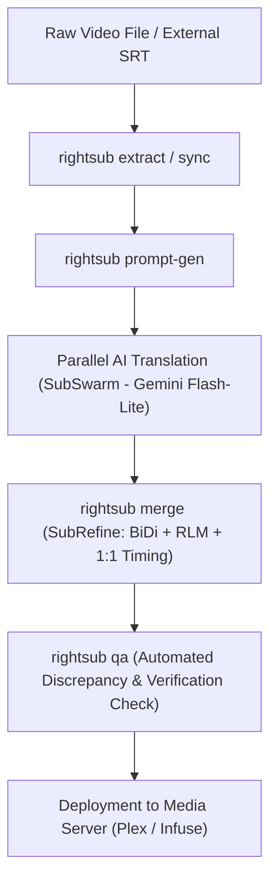

# End-to-End Subtitle Translation & Repair Workflow (RightSub)

This document describes the universal, production-tested workflow for translating or repairing subtitles for **any movie or TV series**.



## Step 1: Subtitle Extraction & Preparation
If embedded in a video:
```bash
./rightsub extract "Movie.mkv" -o "Movie.en.srt"
```

## Step 2: Prompt Generation
Generate wave files and prompts tailored to the movie/show:
```bash
./rightsub prompt-gen "Movie.en.srt" --title "Inception" --genre "Sci-Fi Thriller" --context "Dream architecture, heist, Cobb and Mal"
```

## Step 3: Parallel AI Translation (SubSwarm)
Invoke Gemini 3.5 Flash-Lite agents concurrently (up to 4 agents per wave) using `wave_01.json`, `wave_02.json`.

## Step 4: Merging with RLM & Sanitization (SubRefine)
```bash
./rightsub merge "Movie.en.srt" "translated_batches_dir" -o "Movie.he.srt"
```

## Step 5: Automated QA Audit
```bash
./rightsub qa "Movie.en.srt" "Movie.he.srt"
```
