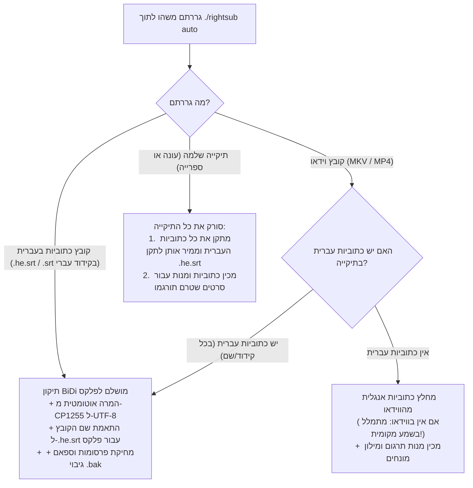

<div dir="rtl">

# 🔰 מדריך פשוט למתחילים — RightSub (מדריך "אפס סיבוך")

<p align="right">
  <b>שפה / Language:</b>
  <b>עברית</b> |
  <a href="QUICKSTART_FOR_BEGINNERS.md"><b>English</b></a>
</p>

ברוכים הבאים ל-**RightSub**!  
אם אינכם מכירים פקודות טרמינל, לא יודעים מה זה "דגלים" (Flags), או שאתם פשוט רוצים תוצאה מושלמת במינימום פעולות — **המדריך הזה נכתב בדיוק עבורכם.**

---

## 🚀 המסלול האולטימטיבי: פקודה אחת בלבד (`./rightsub auto`)

שכחו מריבוי פקודות או אפשרויות מסובכות. בגרסה הנוכחית של RightSub יש פקודת-על אחת שעושה הכל לבד:

```bash
./rightsub auto "גררו לכאן את הקובץ או התיקייה"
```

### 💡 איך מריצים את זה בגרירה פשוטה (Drag & Drop)?
1. פתחו את חלון הטרמינל בתיקיית הפרויקט.
2. הקלידו: `./rightsub auto ` *(שימו לב לרווח בסוף)*.
3. פתחו את ה-**Finder**, תפסו עם העכבר את קובץ הסרט, קובץ הכתובית, או את התיקייה כולה — **וגררו אותה ישירות לתוך חלון הטרמינל**.
4. לחצו על מקש **Enter**.

---

## 🧭 מה המערכת עושה אוטומטית לפי מה שגררתם?



---

## ⚡ 3 תרחישי שימוש יומיומיים

### 1. תיקון כתוביות עברית לפלקס (Plex / Infuse / Apple TV)
- **הבעיה**: סימני שאלה (`?`), נקודות ומקפים קופצים לתחילת השורה, ג'יבריש (קידוד ישן של Windows-1255/Torec), או שחסרה הסיומת `.he` ופלקס מציג את השפה כ-"Unknown".
- **הפתרון**:
  ```bash
  ./rightsub auto "Movie.srt"   # או "Movie.he.srt"
  ```
  *המערכת מזהה אוטומטית את העברית בכל קידוד, ממירה ל-UTF-8 נקי, מתקנת BiDi עם RLM, מוחקת פרסומות, ומשנה את השם אוטומטית ל-`Movie.he.srt` כדי שפלקס ו-Infuse יזהו את השפה מיד. נוצר גיבוי אוטומטי `Movie.srt.bak`.*

### 2. טיפול בעונה שלמה או ספריית סרטים מלאה
- **הבעיה**: יש לכם תיקייה עם 24 פרקים או עשרות סרטים ותרצו לסדר את כולם בלחיצה אחת.
- **הפתרון**:
  ```bash
  ./rightsub auto "/נתיב/לתיקיית/הסדרה_או_העונה/"
  ```
  *המערכת תסרוק את כל תתי-התיקיות, תזהה לבד איזה קבצים הם בעברית ותתקן אותם, ותדלג לחלוטין על קבצי אנגלית כדי לא לפגוע בהם.*

### 3. תרגום סרט/סדרה מאנגלית לעברית
- **הבעיה**: הורדתם סרט עם כתוביות באנגלית ואתם רוצים תרגום איכותי לעברית.
- **הפתרון**:
  ```bash
  ./rightsub auto "Movie.mkv"
  ```
  *המערכת תחלץ את האנגלית, תיצור מילון מונחים עם זיהוי מגדר דמויות מ-TMDb, ותכין תיקיית מנות תרגום מוכנה.*

---

## 🎙️ מה עושים אם בווידאו אין כתוביות בכלל? (תמלול קולי אוטומטי!)

בניגוד לכלים ישנים, ב-RightSub מוטמע כעת מנוע תמלול קולי מקומי (**quicksubs**) המבוסס על מעבדי Apple Silicon ו-Whisper:
- אם תריצו `./rightsub auto "Movie.mkv"` על קובץ שאין בו שום כתוביות, המערכת **לא תיעצר!**
- היא תפעיל אוטומטית את מנגנון ה-Speech-to-Text המקומי על גבי המחשב שלכם, תחלץ את פסקול השמע, ותייצר קובץ כתוביות מקור באנגלית מלא ומדויק לחלוטין.

---

## 🦙 תרגום מקומי ללא אינטרנט דרך Ollama (גיבוי אופליין / ניסיוני)

> [!WARNING]
> **אזהרת איכות קריטית לעברית:**  
> מודלים מקומיים קטנים בקוד פתוח (Llama 3.2, Qwen, Mistral 7B/8B) סובלים מ**איכות תרגום נמוכה מאוד בעברית**:
> 1. **קריסת דקדוק ומגדר**: שגיאות תכופות בין פנייה לזכר ("אתה") לנקבה ("את"), עיוות זמנים והטיית פעלים שגויה.
> 2. **פירוק בייטים (Tokenization)**: אותיות עבריות מפורקות לחלקי בייטים בודדים, מה שגורם לקצב תרגום איטי מאוד ולאובדן הקשר.
> 3. **תרגום מילולי ועילג**: המודל אינו מבין סלנג וביטויים באנגלית ומייצר "עברית מכנית".
> 
> **המלצה חד-משמעית:** שימוש ב-Ollama מיועד **אך ורק למקרי חירום שבהם אין חיבור לרשת או כגיבוי אופליין**. לתרגום איכותי ברמת שידור טלוויזיוני (Broadcast Quality), חובה להשתמש במודלי ענן רב-לשוניים חזקים (כגון **Gemini Flash / Pro**, **Claude 3.5**, או **GPT-4o**).

### איך מפעילים בכל זאת למקרי חירום (ב-2 שלבים):
1. מתקינים את Ollama מהאתר הרשמי [ollama.com](https://ollama.com) (או בטרמינל: `brew install ollama`).
2. מורידים מודל מהיר בטרמינל (פעם אחת בלבד):
   ```bash
   ollama pull llama3.2
   ```

### הפעלת תרגום מקומי (אופליין):
```bash
./rightsub auto "Movie.mkv" --ollama
```

---

## 🤖 רוצים לתת לסוכן ה-AI לעשות הכל בשבילכם?

אם אתם משתמשים בסוכן AI כגון **Google Antigravity**, **Claude Code**, **Cursor**, או **ChatGPT**, אינכם צריכים להריץ פקודות בעצמכם כלל!  
פשוט העתיקו והדביקו לסוכן את המשפט הבא:

> *"השתמש ב-RightSub כדי לתקן ולתרגם את קובצי הכתוביות בתיקייה שלי [נתיב], תוודא שהכל מותאם לפלקס ותעדכן אותי בסיום."*

למדריך המלא של תבניות פרומפטים מובנות לכל סוגי הסוכנים, ראו את [מדריך חיבור לכלי בינה מלאכותית (AI Integration Guide)](AI_INTEGRATION_GUIDE.he.md).

---

## 🛡️ למה זה בטוח לחלוטין? (מנגנוני ההגנה של המערכת)
1. **הגנה על קובצי אנגלית ושפות זרות**: הסקריפט בודק את יחס האותיות העבריות בכל קובץ. כתוביות באנגלית לא ישתנו לעולם.
2. **אי-שכפול תווים (Idempotent)**: הרצה חוזרת ונשנית על אותו קובץ לא תשכפל תווי RLM ולא תפגע בטקסט.
3. **גיבוי אוטומטי מובנה**: לפני כל שינוי של קובץ כתוביות, נוצר עותק שמור בסיומת `.bak`.

</div>
