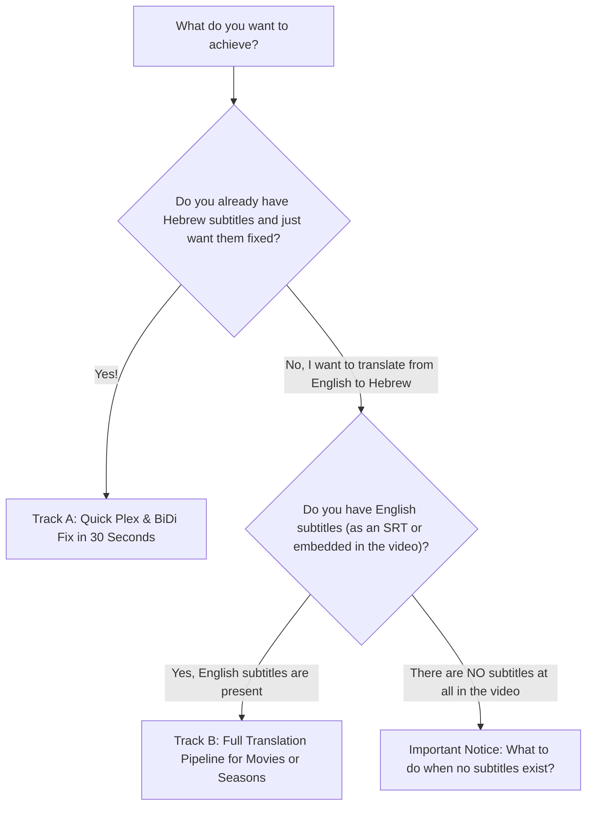

# 🔰 Quickstart for Beginners (Step-by-Step Guide) — RightSub

<p align="left">
  <b>Language / שפה:</b>
  <b>English</b> |
  <a href="QUICKSTART_FOR_BEGINNERS.he.md"><b>עברית</b></a>
</p>

Welcome to **RightSub**!
If you want quick, straightforward instructions without dealing with complex technical jargon, this guide is designed specifically for you.

---

## 🧭 Which Track Fits Your Needs?



---

## ⚡ Track A: "I Just Want to Fix My Subtitles for Plex" (Instant Repair)

### When to use this?
- Question marks (`?`), periods, or dialogue dashes jump to the wrong side of the screen in Plex, Infuse, or Apple TV.
- Subtitles appear as unreadable gibberish / mojibake (legacy CP1255 encoding).
- Subtitles are polluted with annoying hearing-impaired noise (`[DRAMATIC MUSIC PLAYING]`) or website watermark ads.

### How to do it? (Just one command!)
Open your terminal in the RightSub directory and run:
```bash
./rightsub fix-plex "/path/to/your/Movies_or_TV_Shows/" --recursive --in-place --clean-ads --backup
```

**What does this command do for you automatically?**
1. Recursively scans all subtitle files in the folder (including subdirectories).
2. Automatically creates a safety backup (`.srt.bak`) before modifying any file.
3. Fixes reversed punctuation and injects invisible Unicode RLM marks.
4. Cleans legacy CP1255 encoding into clean UTF-8 and strips ads and SDH noise.
5. Produces pristine subtitles ready for Plex playback in seconds!

---

## 🎬 Track B: "I Have English Subtitles and Want a Perfect Hebrew Translation"

### When to use this?
- You have an MKV or MP4 video with embedded English subtitles.
- Or you have an English subtitle file (`movie.en.srt`) alongside your video.

### The 3 Simple Steps:

#### Step 1: Extract English Subtitles (If embedded in the video)
If the subtitles are packed inside an `.mkv` or `.mp4` container, extract them with one command:
```bash
./rightsub extract "Movie.mkv" -o "Movie.en.srt"
```
*(If you already have a `.en.srt` file, skip directly to Step 2).*

#### Step 2: Prepare Translation Chunks & Prompts
RightSub breaks the dialogue down into optimal chunks and prepares context-aware prompts:
```bash
./rightsub prompt-gen "Movie.en.srt" -t "Movie Name"
```
This generates a folder named `prompts_Movie Name` with pre-split batch files ready for AI translation.

#### Step 3: Merge into Final Hebrew SRT
Once translated, assemble the batches into a master `.he.srt` file with 100% timing synchronization and Plex BiDi formatting:
```bash
./rightsub merge "Movie.en.srt" "prompts_Movie Name" -o "Movie.he.srt"
```
**That's it!** You now have a flawless `Movie.he.srt` ready for streaming.

---

## ⚠️ Important Notice: What If the Video Has No Subtitles at All?

### Current Status:
RightSub is a text-based subtitle translation, synchronization, and mastering suite.  
**It does NOT currently perform raw audio Speech-to-Text (Whisper/transcription).**  
Why? Audio speech-to-text often hallucinates or drifts in noisy scenes. Relying on an official English master subtitle ensures **100.0% timing accuracy and zero dropped dialogue cues**.

**What should you do right now if your video has no subtitles?**
1. Visit a subtitle repository (e.g., Subscene, OpenSubtitles, or Addic7ed).
2. Download an English subtitle matching your exact release (e.g., `1080p Web-DL` or `BluRay`).
3. Place it next to your video named `Movie.en.srt`.
4. Proceed directly with **Track B** above!

---

## 🔮 Future Roadmap
Planned for upcoming releases:
- **Automated Web Subtitle Fetcher**: RightSub will inspect the video container's release name and file hash, automatically discover and download the matching master English subtitle from web repositories, and feed it directly into the translation pipeline in a single click.
