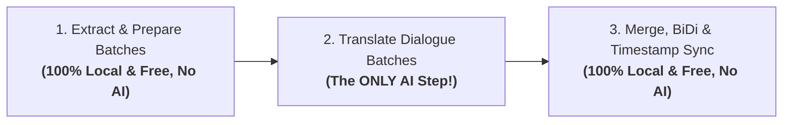

# 🤖 AI Integration & Coding Assistants Guide

<p align="left">
  <b>Language / שפה:</b>
  <b>English</b> |
  <a href="מדריך-חיבור-לכלי-בינה-מלאכותית"><b>עברית</b></a>
</p>

Welcome to the **RightSub** AI Integration Guide. This guide provides step-by-step instructions for connecting RightSub to modern AI coding assistants and LLMs, including **Google Antigravity**, **Claude Code**, **Google Cloud Code / Gemini CLI**, **ChatGPT / Codex**, **Cursor**, and **Windsurf**.

---

## 🛑 Crucial Distinction: What Actually Requires AI vs. What Runs 100% Locally?

Before connecting any AI tool, **it is essential to know that most operations in RightSub require zero AI models, zero API keys, and zero cloud services.**

### 💻 What Runs 100% Locally, Without AI, Offline, and 100% Free? (SubRefine Engine)
7 out of the 8 CLI commands run directly on your local CPU with deterministic precision in milliseconds:

| Local Operation | CLI Command | Requires AI? |
| :--- | :--- | :---: |
| **Extract subtitles from MKV/MP4 containers** | `./rightsub extract` | ❌ **No AI** (Powered by FFmpeg) |
| **Fix Plex/Infuse reversed punctuation & BiDi** | `./rightsub fix-plex` | ❌ **No AI** (Deterministic Unicode RLM) |
| **Fix CP1255 legacy gibberish / mojibake to UTF-8** | `./rightsub fix-plex` | ❌ **No AI** (Smart charset decoding) |
| **Clean ads, sponsor watermark spam & SDH cues** | `./rightsub fix-plex --clean-ads` | ❌ **No AI** (Compiled regex filter) |
| **Fix 25.0 ⟷ 23.976 FPS framerate drift** | `./rightsub adjust-fps` | ❌ **No AI** (Mathematical time stretching) |
| **Compare timing deltas & sync subtitles** | `./rightsub sync` | ❌ **No AI** (Timestamp alignment) |
| **Split master English SRT into batch chunks** | `./rightsub split` / `prompt-gen` | ❌ **No AI** (Algorithmic chunking) |
| **Merge translated batches into final SRT** | `./rightsub merge` | ❌ **No AI** (Time reassembly & RLM injection) |
| **Final Red Team QA audit** | `./rightsub qa` | ❌ **No AI** (1:1 cue verification) |

---

### 🧠 What is the ONLY Step That Requires AI? (SubSwarm Engine)
**Translating the actual dialogue text from English to Hebrew.**  
Subtitles require cultural nuance, humor, legal/medical terminology, idiom adaptation, and grammatical gender consistency (addressing males vs. females). This is where the **SubSwarm Engine** harnesses LLMs to produce literary-quality dialogue translations.



---

## 📦 How Does the Batch Mechanism Work?

When translating a movie or TV episode, you run one preparation command:
```bash
./rightsub prompt-gen "Movie.en.srt" -t "Movie Name"
```
This generates a directory named `prompts_Movie Name/` containing:
- `batch_01_prompt.txt`: Context, character bible, and translation instructions.
- `batch_01_input.json`: English dialogue cues mapped to sequential numeric keys (e.g., `"1": "Hello", "2": "How are you?"`).

Whatever AI assistant you use, its only task is to produce the corresponding output file:
`batch_01_translated.json`
with the exact structure:
```json
{
  "1": "שלום",
  "2": "מה שלומך?"
}
```

---

## 🛠️ Integration Guides by Platform

Choose your preferred tool below:

### 1. Google Antigravity (Default & Recommended Environment)
**Google Antigravity** is the native agentic environment where RightSub was developed. It natively supports multi-agent parallel wave execution.

#### How to use:
In your Antigravity conversation, simply prompt:
> *"Use RightSub to extract subtitles from Movie.mkv, generate translation batches, translate them using subagents, and merge into the final Movie.he.srt."*

Antigravity handles everything autonomously: running the CLI, dispatching parallel subagents, saving the JSON output files, and invoking `merge`.

---

### 2. Claude Code CLI (Anthropic)
Anthropic's terminal agent (`claude`).

#### Steps:
1. Open your terminal in the RightSub directory and launch Claude:
   ```bash
   claude
   ```
2. Generate the batches:
   ```bash
   ./rightsub prompt-gen "Movie.en.srt" -t "Movie Name"
   ```
3. Prompt Claude:
   > *"Read the instructions in prompts_Movie Name/batch_01_prompt.txt and translate all cues from batch_01_input.json into batch_01_translated.json. Maintain the exact JSON schema and numeric keys."*
4. Claude Code will read the files, translate with natural Hebrew phrasing, and save the JSON directly to disk.
5. Once all batches are done, assemble the subtitle:
   ```bash
   ./rightsub merge "Movie.en.srt" "prompts_Movie Name" -o "Movie.he.srt"
   ```

---

### 3. Google Cloud Code / Gemini CLI / Gemini Spark
If you use the Gemini extension in VS Code (Cloud Code / Code Assist) or the Gemini CLI:

#### Steps with Gemini CLI:
1. Generate the batches via `./rightsub prompt-gen`.
2. Pipe the prompt and batch JSON into Gemini (recommended model: `gemini-1.5-flash` or `gemini-1.5-pro`):
   ```bash
   cat prompts_Movie/batch_01_prompt.txt prompts_Movie/batch_01_input.json | gemini > prompts_Movie/batch_01_translated.json
   ```
3. In VS Code using Google Cloud Code:
   Open the Gemini chat pane and prompt:
   > *"Based on prompts_Movie/batch_01_prompt.txt, translate batch_01_input.json and save the result as prompts_Movie/batch_01_translated.json."*

---

### 4. ChatGPT / OpenAI Codex / Web Chat UI
For users who do not use terminal AI tools and prefer the standard web interface:

#### Steps:
1. Generate the batches locally:
   ```bash
   ./rightsub prompt-gen "Movie.en.srt" -t "Movie Name"
   ```
2. Open `batch_01_prompt.txt` in a text editor and paste its contents into ChatGPT.
3. Open `batch_01_input.json` and paste the JSON lines into the chat.
4. Instruct:
   > *"Return ONLY a valid JSON block containing the Hebrew translation for each key, without markdown wrappers or conversational filler."*
5. Copy the returned JSON and save it as `batch_01_translated.json` inside the prompts folder.
6. Run the merge command:
   ```bash
   ./rightsub merge "Movie.en.srt" "prompts_Movie Name" -o "Movie.he.srt"
   ```

---

### 5. AI IDEs: Cursor & Windsurf
When working inside agent-first IDEs:
1. Open the RightSub workspace in Cursor or Windsurf.
2. Open Composer / Agent (`Ctrl+I` or `Cmd+I`).
3. Prompt the agent:
   > *"Process all batch_*_input.json files in prompts_Movie according to their corresponding batch_*_prompt.txt instructions. Save each translated output as batch_XX_translated.json."*
4. The agent will read, translate, and write the output files sequentially.

---

## 🎯 The Golden Rule: Deterministic Local Assembly

No matter which AI assistant translated the dialogue, **the final assembly is always performed locally with 100% mathematical precision:**

```bash
# 1. Assemble into final Hebrew subtitle:
./rightsub merge "Movie.en.srt" "prompts_Movie" -o "Movie.he.srt"

# 2. Run automated Red Team QA check:
./rightsub qa "Movie.en.srt" "Movie.he.srt"
```

The local **SubRefine Engine** automatically guarantees:
- 100.0% timestamp alignment against the master English subtitle.
- Invisible RLM injection preventing punctuation flips on Plex and Apple TV.
- UTF-8 encoding compliance with zero mojibake.
