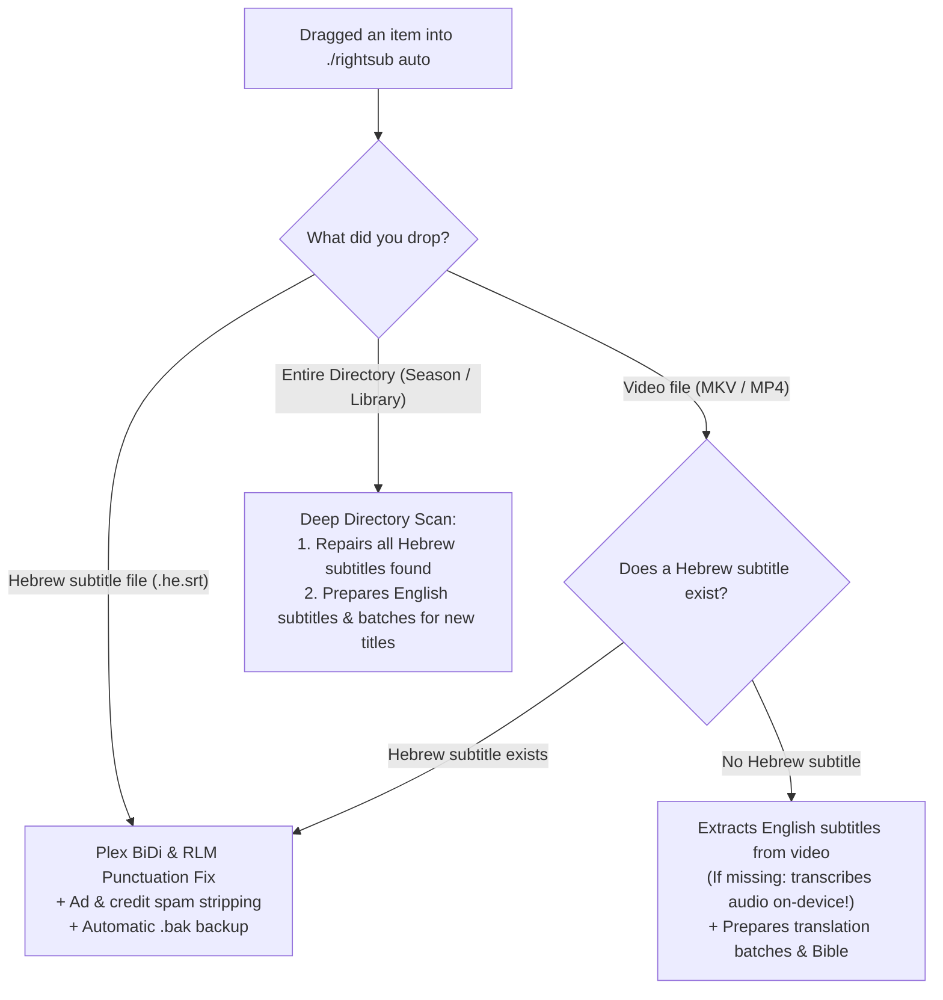

# 🔰 Quickstart for Beginners — RightSub (The Zero-Jargon Guide)

Welcome to **RightSub**!  
If you are unfamiliar with command-line tools, do not know what CLI "flags" are, or simply want perfect Plex subtitles with zero hassle — **this guide was written specifically for you.**

---

## 🚀 The Ultimate Workflow: One Single Command (`./rightsub auto`)

Forget about remembering complex flags or chained commands. In this version of RightSub, a single smart command handles everything automatically:

```bash
./rightsub auto "Drag and drop your file or directory here"
```

### 💡 How to run it using Drag & Drop:
1. Open your Terminal inside the RightSub project folder.
2. Type: `./rightsub auto ` *(make sure to include a space after auto)*.
3. Open **Finder**, click and drag your movie file, subtitle file, or entire TV season folder — **and drop it right onto the Terminal window**.
4. Press **Enter**.

---

## 🧭 What RightSub Does Automatically Based on What You Dragged



---

## ⚡ 3 Common Everyday Scenarios

### 1. Fix Hebrew Subtitles for Plex / Infuse / Apple TV
- **The Issue**: Question marks (`?`), periods, or dashes jump to the wrong end of lines, characters are mojibake gibberish, or lines are cluttered with website ads.
- **The Solution**:
  ```bash
  ./rightsub auto "Movie.he.srt"
  ```
  *The file is fixed in-place, ads are stripped, and a safe `.srt.bak` backup is created automatically.*

### 2. Fix an Entire TV Season or Complete Library
- **The Issue**: You have a folder with 24 episodes or dozens of movies and want them all mastered at once.
- **The Solution**:
  ```bash
  ./rightsub auto "/path/to/TV_Season_or_Movie_Folder/"
  ```
  *The system scans all subdirectories, automatically detects Hebrew files to repair them, and safely ignores English subtitles so they are never corrupted.*

### 3. Translate a Movie from English to Hebrew
- **The Issue**: You downloaded a media file with English subtitles and want a high-grade Hebrew translation.
- **The Solution**:
  ```bash
  ./rightsub auto "Movie.mkv"
  ```
  *The system extracts the English stream, pulls plot & character genders from TMDb, and prepares translation batches.*

---

## 🎙️ What If the Video Has No Subtitles at All? (Automatic Speech-to-Text!)

Unlike traditional subtitle tools that fail when subtitles are missing, RightSub has built-in on-device Speech-to-Text powered by **quicksubs** (Apple SpeechAnalyzer and Whisper):
- If you run `./rightsub auto "Movie.mkv"` on a video with no subtitles, RightSub **will not crash or stop!**
- It automatically invokes the on-device transcription engine, processes the audio stream, and produces a complete, perfectly timed English master subtitle.

---

## 🦙 Offline Local Translation via Ollama (Emergency Fallback / Experimental)

> [!WARNING]
> **Critical Hebrew Quality Limitation:**  
> Small open-weight models (Llama 3.2, Qwen, Mistral 7B/8B) suffer from **severe degradation when translating into Hebrew**:
> 1. **Gender & Grammar Collapse**: Frequent confusion between masculine ("אתה") and feminine ("את") address, corrupted verb conjugations, and wrong plurals.
> 2. **Byte-Level Tokenization**: Hebrew characters are fragmented into raw UTF-8 bytes, leading to slow inference and context degradation.
> 3. **Unnatural / Literal Phrasing**: Slang and cultural idioms are translated literally, resulting in awkward dialogue.
> 
> **Recommendation:** Local Ollama translation is intended **strictly as an offline fallback or experimental feature**. For broadcast-quality subtitles, you must use high-parameter cloud models (**Gemini Flash / Pro**, **Claude 3.5**, or **GPT-4o**).

### Running in emergency/offline mode (in 2 steps):
1. Install Ollama from [ollama.com](https://ollama.com) (or via Homebrew: `brew install ollama`).
2. Download a model (one time only):
   ```bash
   ollama pull llama3.2
   ```

### Running local offline translation:
```bash
./rightsub auto "Movie.mkv" --ollama
```

---

## 🤖 Want Your AI Agent to Do Everything for You?

If you work with AI agents such as **Google Antigravity**, **Claude Code**, **Cursor**, or **ChatGPT**, you don't even have to touch the terminal yourself!  
Simply copy and paste this single prompt to your AI assistant:

> *"Please use RightSub to inspect, fix, and translate the subtitles in my directory [path], ensure 100% Plex compliance, and report back when finished."*

---

## 🛡️ Built-in Safety & Protection
1. **Foreign Language Protection**: RightSub checks the Hebrew character ratio in every file. English subtitles are never touched or modified.
2. **Idempotency**: Running repeatedly on the same file never duplicates RLM marks or degrades formatting.
3. **Automatic Backups**: Creates a `.srt.bak` file before making changes to any file.
