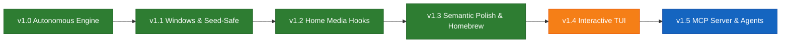

# 🗺️ RightSub Product Roadmap & Milestone Tracker

  <b>Language / שפה:</b>
  <b>English</b> |
  <a href="מפת-דרכים"><b>עברית</b></a>

Welcome to the official **RightSub Product Roadmap**. This document outlines delivered milestones, active priorities, and future architectural initiatives for the RightSub universal subtitle mastering and translation suite.

---

## 🧭 Milestone Progression Overview

---

## 🟢 Shipped Milestones (Production Stable)

### 🌟 [v1.3.0](https://github.com/omerninyo/RightSub/releases/tag/v1.3.0) — Semantic AI Proofreading, Homebrew Universal Tap & Interactive Onboarding
> **Released:** September 2026  
> **Key Capabilities:**
- [x] **Semantic AI Polish (`rightsub polish`)**: Autonomous proofreading engine for existing subtitles based on the Minimal Edit Distance principle (85%–90% preservation target).
- [x] **Hierarchical Domain Knowledge Engine**: 3-tier intelligent context classifier (`domain_knowledge.py`) with domain packs (`SCI_FI`, `MILITARY`, `LEGAL`, `MEDICAL`, `FANTASY`, `UNIVERSAL_IDIOMS`) and **Bilingual Anchor Validation**.
- [x] **Forward Anticipation Drift Guard**: Robust split-cue partitioning (`split_part`) preventing LLMs from collapsing split cues or anticipating future dialogue.
- [x] **Network Storage (SMB/NAS) Metadata Sync**: Explicit `os.utime()` filesystem flushing preventing macOS SMB clients from defaulting to Apple's 2001 epoch.
- [x] **Official Homebrew Tap (`omerninyo/tap`)**: Universal pre-built bottles (`:all`) for instant 1-second installation on Apple Silicon and Intel.
- [x] **Interactive Onboarding & Health Diagnostics**: `rightsub config` (10-second credential setup) and `rightsub doctor` (dependency and environment inspector).

### 🌟 [v1.2.0](https://github.com/omerninyo/RightSub/releases/tag/v1.2.0) — Home Media Automation Stack & Clean-Slate Setup
> **Released:** September 2026  
> **Key Capabilities:**
- [x] **Event-Driven Media Hooks**: Tested hooks for qBittorrent, Sonarr, Radarr, Bazarr, Transmission, and Tautulli/Plex.
- [x] **Zero-Daemon Philosophy**: Proved 0% CPU and 0 MB RAM idle overhead vs heavy polling daemons.
- [x] **Bare-System Onboarding**: Complete setup guides for systems without Homebrew or Winget.

### 🌟 [v1.1.0](https://github.com/omerninyo/RightSub/releases/tag/v1.1.0) — Windows Parity & Seed-Safe Architecture
> **Released:** September 2026  
> **Key Capabilities:**
- [x] **Windows First-Class Parity**: `rightsub.bat`, PowerShell testing, and Windows-1255 encoding recovery.
- [x] **Seed-Safe Architecture**: Non-destructive subtitle generation leaving original downloaded torrent files bit-for-bit intact.

### 🌟 [v1.0.0](https://github.com/omerninyo/RightSub/releases/tag/v1.0.0) — The Autonomous Engine (`rightsub auto`)
> **Released:** September 2026  
> **Key Capabilities:**
- [x] **One-Command Autonomous Pipeline**: Automated embedded track discovery, TMDb entity resolution, and prompt building.
- [x] **SubRefine Engine**: Plex/Infuse RLM BiDi punctuation repair, ad stripper, and SDH noise cleaner.
- [x] **SubSwarm Engine**: Multi-batch AI translation orchestrator with Translation Bible locking.

---

## 🟡 Next Up — Version 1.4.0: Interactive Terminal Experience (TUI) & Deep Ingress

> **Target Release:** Q4 2026  
> **GitHub Milestone:** [`v1.4.0 — Interactive Terminal Experience (TUI)`](https://github.com/omerninyo/RightSub/milestones)  
> **Primary RFCs:**
> - [RFC 001: Interactive Terminal UI (TUI) Specification](Interactive-CLI-Specification)
> - [RFC 003: Autonomous Setup & Health-Check Wizard](Setup-Wizard-Specification)

### Key Planned Features:
- [ ] **Interactive TUI Diff Reviewer (`rightsub polish --interactive`)** ([#1](https://github.com/omerninyo/RightSub/issues/1)):
  - Full-screen terminal user interface (powered by `rich` / `curses`) to inspect modifications one-by-one.
  - Keyboard shortcuts (`[Y] Approve`, `[N] Reject`, `[E] Edit`, `[A] Approve All`).
  - Interactive file explorer to select specific episodes or movies across deep directory structures.
- [ ] **Automated Downloader Hook Installer & Service Wrapper** ([#2](https://github.com/omerninyo/RightSub/issues/2)):
  - `rightsub config --install-hooks`: Auto-detects installed qBittorrent, Sonarr, or Radarr instances and writes complete completion scripts automatically.
  - Optional lightweight systemd (Linux) and launchd (macOS) service generator for headless media servers requiring automated directory watching.

---

## 🔵 On the Horizon — Version 1.5.0: Agentic Subtitle Protocol & MCP Server

> **Target Release:** Q1 2027  
> **GitHub Milestone:** [`v1.5.0 — Agentic Subtitle Protocol & MCP Server`](https://github.com/omerninyo/RightSub/milestone/2)  
> **Primary RFC:**
> - [RFC 002: RightSub Native Model Context Protocol (MCP) Server](MCP-Server-Specification)

### Key Planned Features:
- [ ] **Official MCP Server (`rightsub mcp`)** ([#3](https://github.com/omerninyo/RightSub/issues/3)):
  - Standard JSON-RPC stdio transport for **Claude Desktop**, **Antigravity**, **Cursor**, **Windsurf**, and **ChatGPT Desktop**.
  - Exposes `inspect_media`, `extract_subtitles`, `fix_plex_bidi`, and `polish_cues` tools.
- [ ] **Natural Language Media Control**:
  - Allows AI assistants to converse with users about subtitles, verify quality, and apply fixes directly from chat.
- [ ] **Streaming Subtitle Translation**:
  - Real-time line-by-line streaming translation for live recordings or instant previewing.

---

## 🟣 Future Explorations & Community Backlog

The following ideas are actively tracked for research and community feedback:
- **Web UI & Dashboard**: Lightweight local browser interface (FastAPI / HTML5) for visual library auditing.
- **Multilingual Support**: Expanding SubRefine BiDi and character normalization to Arabic, Persian, and Cyrillic script families.
- **Whisper Fine-Tuning for Hebrew Audio**: Specialized acoustic model for Hebrew speech recognition and speech-aligned retiming.

---

## 📋 Roadmap Governance & Contributing

- **Proposing New Ideas**:
  1. Open a discussion or issue on GitHub.
  2. For complex technical features, author an RFC document in `docs/proposals/RFC_XXX_<TITLE>.md`.
  3. Once approved, the feature is assigned a target Milestone and tracked in this Roadmap.
- **Lifecycle Statuses**:
  - `Proposed`: Community or internal RFC under review.
  - `Planned`: Committed to a specific version milestone.
  - `In Progress`: Active development and unit testing.
  - `Shipped`: Merged to `main`, bottle packaged, and documented in `WHATS_NEW`.
