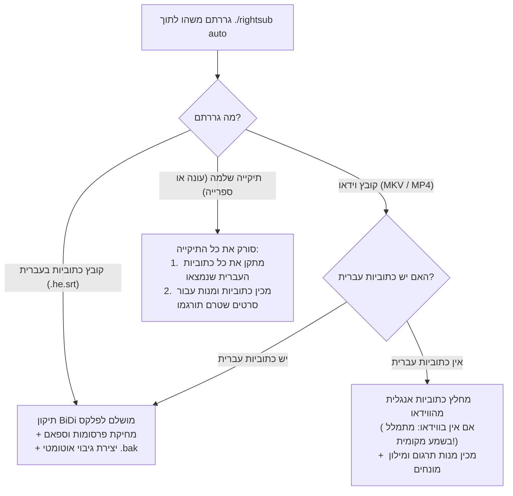

<div dir="rtl">

# 🔰 מדריך פשוט למתחילים — RightSub (מדריך "אפס סיבוך")

ברוכים הבאים ל-**RightSub**!  
אם אינכם מכירים פקודות טרמינל, לא יודעים מה זה "דגלים" (Flags), או שאתם פשוט רוצים תוצאה מושלמת במינימום פעולות — **המדריך הזה נכתב בדיוק עבורכם.**

---

## 🚀 המסלול האולטימטיבי: פקודה אחת בלבד (`./rightsub auto`)

שכחו מריבוי פקודות או אפשרויות מסובכות. בגרסה הנוכחית של RightSub יש פקודת-על אחת שעושה הכל לבד:

```bash
./rightsub auto "גררו לכאן את הקובץ או התיקייה"
```

### 💡 איך מריצים את זה בגרירה פשוטה (Drag & Drop)?
1. פתחו את חלון הטרמינל בתיקיית הפרויקט.
2. הקלידו: `./rightsub auto ` *(שימו לב לרווח בסוף)*.
3. פתחו את ה-**Finder**, תפסו עם העכבר את קובץ הסרט, קובץ הכתובית, או את התיקייה כולה — **וגררו אותה ישירות לתוך חלון הטרמינל**.
4. לחצו על מקש **Enter**.

---

## 🧭 מה המערכת עושה אוטומטית לפי מה שגררתם?



---

## ⚡ 3 תרחישי שימוש יומיומיים

### 1. תיקון כתוביות עברית לפלקס (Plex / Infuse / Apple TV)
- **הבעיה**: סימני שאלה (`?`), נקודות ומקפים קופצים לתחילת השורה, ג'יבריש, או פרסומות של אתרי כתוביות.
- **הפתרון**:
  ```bash
  ./rightsub auto "Movie.he.srt"
  ```
  *הקובץ יתוקן ישירות במקום, פרסומות יימחקו, וייווצר גיבוי אוטומטי `Movie.he.srt.bak` למקרה הצורך.*

### 2. טיפול בעונה שלמה או ספריית סרטים מלאה
- **הבעיה**: יש לכם תיקייה עם 24 פרקים או עשרות סרטים ותרצו לסדר את כולם בלחיצה אחת.
- **הפתרון**:
  ```bash
  ./rightsub auto "/נתיב/לתיקיית/הסדרה_או_העונה/"
  ```
  *המערכת תסרוק את כל תתי-התיקיות, תזהה לבד איזה קבצים הם בעברית ותתקן אותם, ותדלג לחלוטין על קבצי אנגלית כדי לא לפגוע בהם.*

### 3. תרגום סרט/סדרה מאנגלית לעברית
- **הבעיה**: הורדתם סרט עם כתוביות באנגלית ואתם רוצים תרגום איכותי לעברית.
- **הפתרון**:
  ```bash
  ./rightsub auto "Movie.mkv"
  ```
  *המערכת תחלץ את האנגלית, תיצור מילון מונחים עם זיהוי מגדר דמויות מ-TMDb, ותכין תיקיית מנות תרגום מוכנה.*

---

## 🎙️ מה עושים אם בווידאו אין כתוביות בכלל? (תמלול קולי אוטומטי!)

בניגוד לכלים ישנים, ב-RightSub מוטמע כעת מנוע תמלול קולי מקומי (**quicksubs**) המבוסס על מעבדי Apple Silicon ו-Whisper:
- אם תריצו `./rightsub auto "Movie.mkv"` על קובץ שאין בו שום כתוביות, המערכת **לא תיעצר!**
- היא תפעיל אוטומטית את מנגנון ה-Speech-to-Text המקומי על גבי המחשב שלכם, תחלץ את פסקול השמע, ותייצר קובץ כתוביות מקור באנגלית מלא ומדויק לחלוטין.

---

## 🦙 תרגום 100% מקומי וחינמי ללא אינטרנט (דרך Ollama)

רוצים לתרגם את הסרט שלכם בלי לשלם על מפתחות API ובלי לשלוח מידע לאינטרנט?  
אפשר להריץ מודל שפה מקומי במחשב (כמו Llama 3.2 או Qwen 2.5) בחינם לחלוטין!

### איך מתחילים עם Ollama ב-2 שלבים:
1. מתקינים את Ollama מהאתר הרשמי [ollama.com](https://ollama.com) (או בטרמינל: `brew install ollama`).
2. מורידים מודל מהיר בטרמינל (פעם אחת בלבד):
   ```bash
   ollama pull llama3.2
   ```

### מעכשיו – תרגום מלא של סרט מקצה לקצה בפקודה אחת:
```bash
./rightsub auto "Movie.mkv" --ollama
```
המערכת תחלץ את הכתוביות, תתרגם את כל השורות באמצעות המחשב שלכם ללא שום עלות, תחיל עיצוב BiDi מושלם לפלקס, ותייצר קובץ סופי `Movie.he.srt`!

---

## 🤖 רוצים לתת לסוכן ה-AI לעשות הכל בשבילכם?

אם אתם משתמשים בסוכן AI כגון **Google Antigravity**, **Claude Code**, **Cursor**, או **ChatGPT**, אינכם צריכים להריץ פקודות בעצמכם כלל!  
פשוט העתיקו והדביקו לסוכן את המשפט הבא:

> *"השתמש ב-RightSub כדי לתקן ולתרגם את קובצי הכתוביות בתיקייה שלי [נתיב], תוודא שהכל מותאם לפלקס ותעדכן אותי בסיום."*

---

## 🛡️ למה זה בטוח לחלוטין? (מנגנוני ההגנה של המערכת)
1. **הגנה על קובצי אנגלית ושפות זרות**: הסקריפט בודק את יחס האותיות העבריות בכל קובץ. כתוביות באנגלית לא ישתנו לעולם.
2. **אי-שכפול תווים (Idempotent)**: הרצה חוזרת ונשנית על אותו קובץ לא תשכפל תווי RLM ולא תפגע בטקסט.
3. **גיבוי אוטומטי מובנה**: לפני כל שינוי של קובץ כתוביות, נוצר עותק שמור בסיומת `.bak`.

</div>
