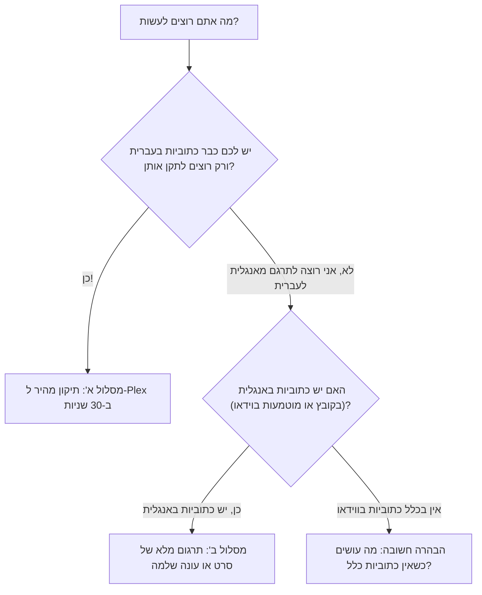

<div dir="rtl">

# 🔰 מדריך פשוט למתחילים (צעד אחר צעד)

<p align="right">
  <b>שפה / Language:</b>
  <b>עברית</b> |
  <a href="Quickstart-for-Beginners"><b>English</b></a>
</p>

ברוכים הבאים ל-**RightSub**!
אם אתם לא רוצים להסתבך עם פקודות מורכבות או מושגים טכניים, המדריך הזה נכתב במיוחד בשבילכם.

---

## 🧭 איזה מסלול מתאים לכם?



---

## ⚡ מסלול א': "אני רק רוצה לתקן את הכתוביות שלי לפלקס" (תיקון מהיר)

### מתי משתמשים בזה?
- סימני שאלה (`?`), נקודות ומקפים קופצים לצד הלא נכון ב-Plex, Infuse או Apple TV.
- הכתוביות מופיעות כג'יבריש מוזר (קידוד ישן).
- הכתוביות מלאות ברעשי רקע מעצבנים כמו `[מוזיקה דרמטית]` או פרסומות של אתרי כתוביות.

### 3 דרכים פשוטות להפעלה:

#### אפשרות 1: תיקון קובץ בודד
רוצים לתקן רק סרט אחד ספציפי?
```bash
./rightsub fix-plex "Movie.he.srt" --in-place
```

#### אפשרות 2: תיקון מספר קבצים ספציפיים
רוצים לתקן כמה פרקים מסוימים ביחד? העבירו את שמות הקבצים ברצף:
```bash
./rightsub fix-plex "Episode01.he.srt" "Episode02.he.srt" "Episode03.he.srt" --in-place
```

#### אפשרות 3: תיקון תיקייה שלמה או ספרייה מלאה (כולל תתי-תיקיות)
רוצים לסדר עונה שלמה או את כל ספריית הסרטים שלכם בבת אחת?
```bash
./rightsub fix-plex "/נתיב/לתיקיית/הסרטים_או_הסדרות/" --recursive --in-place --clean-ads --backup
```

---

### 🛡️ למה זה בטוח לחלוטין להרצה על כל תיקייה? (מנגנוני ההגנה של הסקריפט)
אין צורך למיין קבצים ידנית לפני ההרצה. הסקריפט כולל סינון חכם מובנה:
1. **זיהוי שפה אוטומטי (נוגע אך ורק בעברית!)**:  
   הסקריפט בודק את יחס האותיות העבריות בכל קובץ. אם יש בתיקייה כתוביות באנגלית (`.en.srt`), ספרדית או כל שפה אחרת — **הוא מזהה אותן ומדלג עליהן אוטומטית**. כתוביות באנגלית לא ישתנו לעולם.
2. **סינון סוגי קבצים בלעדי**:  
   הסקריפט מתעלם לחלוטין מקובצי וידאו (MKV, MP4), תמונות פוסטרים או קובצי מטא-דאטה (`.nfo`), ופועל רק על קובצי כתוביות (`.srt`).
3. **בדיקת נחיצות ואי-שכפול תווים (Idempotent)**:  
   הסקריפט בודק האם הכתובית כבר תקינה או שכבר הוזרקו לה תווי RLM. אם הקובץ כבר מתוקן, הסקריפט מדלג עליו ולא ישכפל תווים סמויים.
4. **מצבי בטיחות מלאים**:  
   - הוסיפו `--dry-run` בכל שלב כדי לקבל דוח תצוגה מקדימה מבלי לשנות אף קובץ בדיסק.
   - הדגל `--backup` יוצר אוטומטית קובץ גיבוי (`.srt.bak`) לפני כל שינוי.

---

## 🎬 מסלול ב': "יש לי סרט/סדרה עם כתוביות באנגלית, ואני רוצה תרגום מושלם לעברית"

### מתי משתמשים בזה?
- הורדתם סרט או עונה של סדרה בקובץ MKV/MP4 שמכיל כתוביות באנגלית בפנים.
- או שיש לכם קובץ כתוביות באנגלית (`movie.en.srt`) לצד הווידאו.

### תהליך 3 השלבים הפשוט:

#### שלב 1: חילוץ כתוביות האנגלית (אם הן עדיין בתוך הווידאו)
אם הכתוביות מוטמעות בתוך קובץ הווידאו (`.mkv` או `.mp4`), חלצו אותן בפקודה אחת:
```bash
./rightsub extract "Movie.mkv" -o "Movie.en.srt"
```
*(אם כבר יש לכם קובץ `.en.srt` מוכן, דלגו ישר לשלב 2).*

#### שלב 2: הכנת מנות התרגום
הכלי יחלק את הכתוביות למנות אופטימליות ויכין פרומפטים עשירים בעלילה:
```bash
./rightsub prompt-gen "Movie.en.srt" -t "שם הסרט"
```
הפקודה תיצור תיקייה חדשה בשם `prompts_שם הסרט` עם מנות עבודה מוכנות.

#### שלב 3: מיזוג לקובץ עברית מושלם
לאחר שהסוכנים השלימו את התרגום, נאחד את הכל לקובץ `.he.srt` מסונכרן בדיוק של 100% ומוכן לפלקס:
```bash
./rightsub merge "Movie.en.srt" "prompts_שם הסרט" -o "Movie.he.srt"
```
**זהו!** קיבלתם קובץ `Movie.he.srt` מסונכרן במילי-שנייה, מעוצב ב-BiDi, ונקי לחלוטין לצפייה.

---

## ⚠️ הבהרה חשובה: מה עושים כשאין כתוביות בכלל בווידאו?

### המצב הנוכחי:
RightSub היא מערכת תרגום, סנכרון והשבחה המבוססת על **כתוביות מקור** (Text-to-Text).  
**היא אינה מבצעת כרגע תמלול קולי מאפס (Speech-to-Text / Whisper).**  
למה? תמלול קולי מאפס נוטה לפספס מילים במקומות רועשים ולשבש תזמונים. שימוש בכתובית מקור רשמית באנגלית מבטיח **100% דיוק וסנכרון תזמונים מושלם**.

**מה עושים כרגע אם הווידאו שלכם נקי לחלוטין מכתוביות?**
1. נכנסים לאתר כתוביות מוכר (כגון Subscene, OpenSubtitles או Addic7ed).
2. מורידים כתובית באנגלית שמתאימה בדיוק לגרסת השחרור שלכם (למשל `1080p Web-DL` או `BluRay`).
3. שומרים אותה באותה תיקייה בשם `Movie.en.srt`.
4. ממשיכים מיד ב**מסלול ב'** למעלה!

---

## 🔮 מפת דרכים לעתיד (Roadmap)
בתכנון לגרסאות הבאות:
- **איתור והורדה אוטומטית מאתרי כתוביות**: המערכת תזהה את טביעת האצבע (Hash) ושם השחרור של קובץ הווידאו, תאתר אוטומטית כתובית מקור מושלמת באנגלית מאתרי כתוביות ברשת, ותזין אותה ישירות למסלול התרגום בלחיצת כפתור אחת!

</div>
