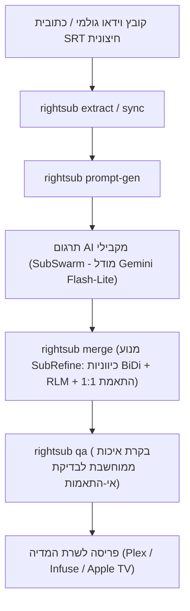

<div dir="rtl">

# תהליך עבודה אנד-טו-אנד לעיבוד ותרגום כתוביות

<p align="right">
  <b>שפה / Language:</b>
  <b>עברית</b> |
  <a href="Pipeline-Workflow"><b>English</b></a>
</p>

---

מסמך זה מתאר את תהליך העבודה האוניברסלי והמוכח לתרגום או תיקון של כתוביות עבור **כל סרט או סדרת טלוויזיה**.



---

## שלב 1: חילוץ והכנת כתוביות
במידה והכתוביות מובנות בקובץ הווידאו:
```bash
./rightsub extract "Movie.mkv" -o "Movie.en.srt" --lang eng
```

---

## שלב 2: מחולל הפרומפטים וגלי הסוכנים
הפקת מנות עבודה אופטימליות (~210 שורות) ופרומפטים עשירים בעלילה:
```bash
./rightsub prompt-gen "Movie.en.srt" --title "Inception" --genre "מדע בדיוני ומתח" --context "ארכיטקטורת חלומות, שוד תודעתי, קוב ומאל"
```

---

## שלב 3: תרגום מקבילי באמצעות AI (מנוע SubSwarm)
הפעלת סוכני Gemini 3.5 Flash-Lite במקביל (עד 4 סוכנים לכל גל) באמצעות קובצי התצורה המוכנים `wave_01.json`, `wave_02.json`.

---

## שלב 4: מיזוג, נרמול והזרקת RLM (מנוע SubRefine)
הרכבת מנות התרגום לקובץ SRT סופי, תוך נרמול הומוגליפים, המרת גרשיים תקניים והזרקת RLM מלאה:
```bash
./rightsub merge "Movie.en.srt" "translated_batches_dir" -o "Movie.he.srt"
```

---

## שלב 5: ביקורת איכות אוטומטית (Red Team QA)
אימות ממוחשב שכל אינדקס וכל מילי-שנייה זהים במדויק לקובץ המקור:
```bash
./rightsub qa "Movie.en.srt" "Movie.he.srt"
```

</div>
